# 使い方マニュアル

幾何音響シミュレーション（音線法 ＋ 虚音源バックトレース）の**操作手順書**。
「何を用意して、どのボタンを押すと、どのファイルが出てくるか」を画面写真つきで順に説明する。

- 数式とプログラムの中身 … `docs/技術説明書.md`
- CAD 側の作図ルール（詳細版）… `docs/DXFデータの作り方.md`
- 各モジュールの役割・既知の問題 … `PROGRAM_STRUCTURE.md`

## この資料の例題

説明はすべて、次のモデルを実際に計算した画面で示している。
**同じものを手元で試せる**ように、DXF をリポジトリに入れてある。

```
docs\例題\五角形の部屋.dxf
```

| 項目 | 値 |
|---|---|
| 形 | 五角形平面（外形 3.0 × 4.0 m）× 天井高 2.7 m |
| 床面積 / 容積 / 総表面積 | 9.90 m² / 26.73 m³ / 53.02 m² |
| レイヤ（＝吸音材の単位） | `床` / `天井` / `壁` / `吸音板` |
| 音源 | `src` レイヤに 1 点（1.5, 0.8, 1.5） |
| 受音点 | `rec` レイヤに 3 点（高さ 1.2 m） |
| 単位 | mm（DXF の `INSUNITS` = 4） |

**わざと平行でない壁を入れてある。**直方体だと平行面の影響ばかりが出て、
形の効きが分からないため。

---

## 0. 全体の流れ

```
  1. DXF を用意する      室形状・音源（src）・受音点（rec）を CAD で描く
        |
  2. 条件入力            python app.py
        |                プロジェクトフォルダ・DXF・音線数・大気条件など
  3. 条件表.xlsx を作る   どのレイヤに、どの吸音材を貼るか
        |
  4. 面を確認            法線の向き（緑=OK / 赤=要反転）と吸音材を目で見る
        |
  5. 計算する            数分〜数十分。結果 CSV ＋ 図 PNG ＋ Excel が出る
        |
  6. 結果を見る          Excel（人が読む）／CSV（機械が読む）／3D 画面
```

2〜6 は**同じウィンドウの往復**で、`app.py` が順に開く。
4 で保存すると 2 に戻り、そこから 5 へ進む。

---

## 1. 準備（初回だけ）

### 1-1. Python 環境

**Python 3.10.11** を使う（チーム方針。`.python-version` に書いてある）。
端末によっては `python` が 3.10 以外を指すので、**インタプリタを明示して** venv を作る。

```powershell
cd C:\...\nea-simulation-pj
py -3.10 -m venv .venv
.\.venv\Scripts\python -m pip install --upgrade pip
.\.venv\Scripts\python -m pip install -r requirements-lock.txt
```

`requirements.txt` でもよいが、端末どうしで挙動を完全に揃えたいときは
`requirements-lock.txt`（動作確認済みの厳密な組み合わせ）を使う。

確認：

```powershell
.\.venv\Scripts\python tests\test_geosim.py
```

**829 件すべて OK** と出れば準備完了。

### 1-2. 起動のしかた

`geosim/` の中は `from mesh import Mesh` のような**ベア名インポート**なので、
**`geosim` を作業ディレクトリにして**実行する。

```powershell
cd C:\...\nea-simulation-pj\geosim
..\.venv\Scripts\python app.py
```

以後この文書では、上のように `cd geosim` した状態を前提に `python app.py` と書く
（`python` は `..\.venv\Scripts\python` のこと）。

```powershell
python app.py                                 条件入力から始める（新規）
python app.py "C:\...\プロジェクト"            そのプロジェクトを開いて始める
python app.py "C:\...\プロジェクト" --run      入力画面を出さずにすぐ計算する
```

---

## 2. DXF を用意する

CAD 側で守ることは 4 つだけ。詳細は `docs/DXFデータの作り方.md`。

| 項目 | 決まり |
|---|---|
| 面 | 3DFACE / ポリフェイスメッシュ / 閉じた 3D ポリライン。**REGION・3DSOLID はそのままでは読めない**（下記） |
| レイヤ | **レイヤ ＝ 吸音材の単位**。壁・床・天井・吸音板…を別レイヤに分ける |
| 音源 | レイヤ名 `src` に点を置く |
| 受音点 | レイヤ名 `rec` に点を置く。**`rec1` `rec2` `rec3` のような連番レイヤでもよい**（測線ごとの評価に使う） |
| 単位 | DXF の `INSUNITS` を見る。mm でも m でもよい |

補足：

- **音源と重なる受音点は自動で外す**（そこでは音圧が発散するため）。
- 法線の向きは CAD で気にしなくてよい。読み込み時に「自動」で揃える。
- **REGION / 3DSOLID の DXF** は面に変換してから読む。AutoCAD が入っている端末なら：

```powershell
python dxf_faces.py "C:\...\室.dxf"        →  室_faces.dxf ができる
```

  元のファイルは触らない。円弧・スプライン・穴あき（輪が 2 つ以上）は数えて知らせる。
  ただし**直方体の 3DSOLID だけは、そのままでも 8 隅から面を起こせる**（半無響室など）。

### 2-1. モデルだけ先に確認する

計算条件を決める前に、**容積と面積が想定どおりか**を見ておくと後が楽。

```powershell
python read_dxffile.py "..\docs\例題\五角形の部屋.dxf"
```

例題での出力（抜粋）:

```
[read_dxffile] 三角形メッシュ: 16 枚
[read_dxffile] 単位: 1 CAD単位 = 0.001 m（INSUNITS=4）
[read_dxffile] レイヤ別の枚数: {'床': 3, '天井': 3, '壁': 6, '吸音板': 4}
[read_dxffile] 音源: [[1.5, 0.8, 1.5]]
[read_dxffile] 受音点: [[1.5, 2.0, 1.2], [0.8, 3.1, 1.2], [2.3, 3.1, 1.2]]
[read_dxffile] 寸法: [3.0, 4.0, 2.7] m (min=[0.0, 0.0, 0.0])
[read_dxffile] 総表面積: 53.020 m2
[read_dxffile] 容積: 26.730 m3（法線（発散定理））  平均自由行程 2.017 m
[read_dxffile] シェル（連結した面のかたまり）: 1 個
[read_dxffile]   シェル0 [外殻] 面16枚 閉 体積26.7300m3 法線=inward OK
[check] 作図チェック: 問題は見つかりませんでした
```

**面が閉じているかを見たい**ときは：

```powershell
python open_edges.py "C:\...\プロジェクト"
```

**自由端**（赤・本当に穴が空いている）と **T字接合**（橙・壁を帯で分割しただけ。問題なし）を
分けて出す。表（`結果/<室>_開いた辺.csv`）と図（`図/<室>_開いた辺.png`）も出る。

> モデル作成者に渡す道具もある。`配布\閉じ判定\` の AutoCAD LISP を使うと、
> Python もこのリポジトリも無しで、**AutoCAD の中で**自由端を赤く表示できる。

---

## 3. 条件入力

`python app.py` を実行すると出る画面。上から順に埋める。

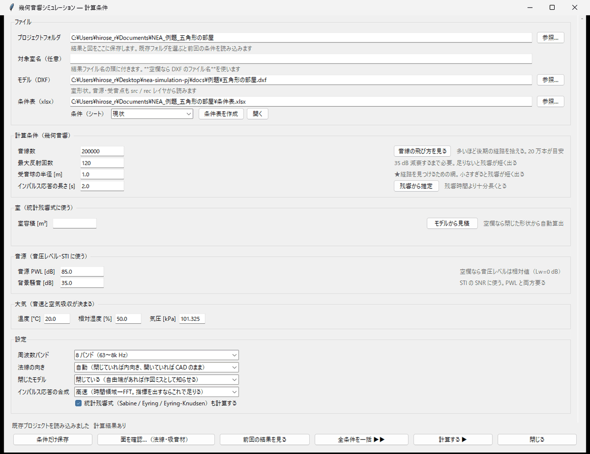

### 3-1. ファイル

| 欄 | 意味 |
|---|---|
| プロジェクトフォルダ | **結果と図の保存先**。既存フォルダを選ぶと前回の条件を読み込む |
| 対象室名（任意） | 結果ファイル名の頭に付く。**空欄なら DXF のファイル名**を使う |
| モデル（DXF） | 室形状。音源・受音点も `src` / `rec` レイヤから読む |
| 条件表（xlsx） | レイヤー名 → 材料番号の対応表。**シート 1 枚が条件 1 つ** |
| 条件（シート） | 使う条件を選ぶ。**シート名が条件名**になり、結果ファイル名に入る |

条件表がまだ無ければ、その場の**「条件表を作成」**ボタンで作れる（第 4 章）。

> ★**「条件（シート）」は明示的に選んでおくこと。**空欄のままでも計算はできるが、
> 結果ファイル名に条件名が付かず、あとで `inverse_square.py` などの
> 後処理ツールが結果を見つけられないことがある。

### 3-2. 計算条件（幾何音響）

| 欄 | 例題の値 | 決め方 |
|---|---|---|
| 音線数 | 200000 | 多いほど後期の経路を拾える。20 万本が目安 |
| 最大反射回数 | 120 | **35 dB 減衰するまで**必要。足りないと残響が短く出る |
| 受音球の半径 [m] | 1.0 | ★下記。小さすぎると残響が短く出る |
| インパルス応答の長さ [s] | 2.0 | 残響時間より十分長く。「残響から推定」ボタンで理論値の 1.5 倍が入る |

**★受音球の半径がいちばん間違えやすい。**

受音球はエネルギーを集める器ではなく、**経路を見つけるための網**。
エネルギー自体はバックトレースが厳密に出し、成り立たない経路は却下する。
ある経路が見つかる確率はおよそ `N·r²/(4d²)`（N=音線数、r=半径、d=経路長）で、
`d = ct` だから**遅い時刻ほど取りこぼす**。その結果、後期のエネルギーが足りず
**残響時間が短く出る**。

目安は次の式。

```
t_max = r√N / (2c)  >  求めたい減衰時間

例題（r = 1.0 m, N = 200000, c = 344 m/s）… t_max = 0.65 s
T30 は 35 dB 減るまで見るので、必要なのは T30 × 0.58 ≒ 0.42 s → 足りている
```

372 m³ の室・音線 20 万本では、既定の 0.15 m だと 0.098 秒ぶんしか拾えず、
T30 が 3〜4 割短く出た（2026-08-14 の実データ）。この例では r ≥ 1.0 m で収束した。

> **半径を変えても値が動かないことを確かめてから、数字を使うこと。**

### 3-3. 音線の飛び方を見る

「音線数」の右の**「音線の飛び方を見る」**ボタンで、音源から音線が球状に均等に
出ている様子を確認できる。**室形状とは関係ない**ので、モデルが無くても見られる。

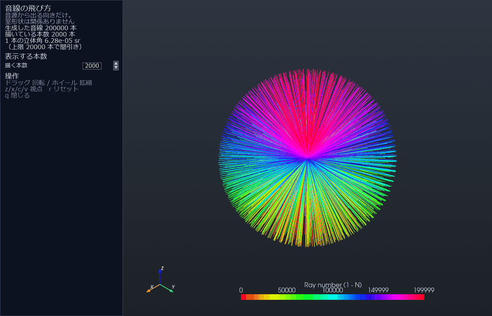

色は音線の番号（1 本目 → 最後）。等立体角に並んでいることが螺旋として見える。
左の欄で描く本数を変えられる（実際に飛ぶのは「音線数」で指定した本数）。

### 3-4. 室・音源・大気

| 欄 | 例題の値 | 意味 |
|---|---|---|
| 室容積 [m³] | 空欄 | 統計残響式（Sabine ほか）に使う。**空欄なら閉じた形状から自動算出**。「モデルから見積」ボタンで容積・表面積・平均吸音率が出る |
| 音源 PWL [dB] | 85.0 | **空欄なら音圧レベルは相対値**（Lw = 0 dB として計算し、出力にもそう書く） |
| 背景騒音 [dB] | 35.0 | STI の SNR に使う。**PWL と両方そろっていないと効かない** |
| 温度 / 相対湿度 / 気圧 | 20℃ / 50% / 101.325 kPa | **音速と空気吸収の両方が連動する** |

> ★**気圧の単位は kPa**（101.325）。Pa を入れると密度が 1000 倍になり、音圧レベルが
> 30 dB ずれる。桁を見て止めるようにはなっているが、入力時に気をつけること。

### 3-5. 設定（プルダウン）

| 欄 | 選べるもの | 備考 |
|---|---|---|
| 周波数バンド | 8 バンド（63〜8k Hz）/ 6 バンド（125〜4k Hz） | 6 バンドだと STI の 8 kHz が無いので重みを外して正規化し、警告が出る |
| 法線の向き | **自動**（閉じていれば内向き、開いていれば CAD のまま）/ CAD のまま / 面ごとに室内側 / シェル単位 / 全反転 | ふつうは「自動」 |
| 閉じたモデル | **自動** / 閉じている / 閉じていない | ★下記 |
| インパルス応答の合成 | **高速**（時間領域→FFT）/ 厳密（式(2) をそのまま） | 指標を出すだけなら高速で足りる。**FDTD などの波動解と波形を突き合わせるときだけ厳密** |
| 減衰曲線の読み取り方 | **ISO 3382**（区間の全点に直線を当てる）/ 2 点法 | ★下記の「RTany」と同じ枠にあります |
| 音源が複数のとき | **すべて** / 個別のみ / 個別＋平均 / 個別＋重ね合わせ（時間差あり） / 個別＋重ね合わせ（時間差なし） | ★第 6-4 節。音源が 1 点なら何も変わらない |
| 統計残響式も計算する | チェック | Sabine / Eyring / Eyring-Knudsen |

**★「閉じたモデル」は利用者が決めること。**
一面反射板だけの検討もあるので、自由端があること自体はモデルの側では良し悪しが決まらない。

- **閉じている** … 自由端があれば**作図ミス**として警告する
- **閉じていない** … 自由端を指摘しない（注意止まり）
- **自動**（既定）… どちらの可能性も伝える。決めつけない

### 3-6. 画面下のボタン

| ボタン | 動き |
|---|---|
| 条件だけ保存 | `project.json` に書いて閉じない |
| 測定点の並び… | **`結果/recN/` の N をどの点にするか**を並べ替える（★下記） |
| 面を確認…（法線・吸音材） | 3D 画面を開く（第 5 章） |
| 前回の結果を見る | **計算し直さずに**、保存済みの結果を読んで図を描き直し、可視化画面を開く |
| 全条件を一括 ▶▶ | 条件表の全シートを順に回す（第 4-3 節） |
| 計算する ▶ | 計算を始める（第 6 章） |

---

## 4. 条件表（`条件表.xlsx`）＝ 吸音材の割り当て

**CAD を触らずに材料を差し替えるための入力ファイル。**プロジェクトフォルダ直下に置く。
入力なので、ファイル名に対象室名・条件名は付けない。

条件入力の**「条件表を作成」**を押すと、DXF のレイヤを並べた雛形ができる
（計算時に無ければ自動でも作られる）。

**★「測定点の並び…」は、CAD のラベルと番号がずれたときに使う。**

受音点は **DXF に描いた順**に `rec1` `rec2` …と番号が付く。CAD 側で R1〜R5 と
ラベルを振っていても、描いた順が違えば **`rec1` が R4** になる（実際に起きた）。
気づかずに結果を読むと点を取り違えるので、この窓で上下に動かして合わせる。

- 上から順に `src1` / `rec1` …になる。右の「DXF の N 番目」が元の順番
- 「CAD の順に戻す」で元どおり
- 保存先は `プロジェクトフォルダ/測定点順.json`
- ★**次の計算から効く**（計算済みの `結果/recN/` は並べ替えない）
- ★DXF を描き直して点の数が変わったら、その並びは**使われない**
  （黙って取り違えないように。もう一度並べ替える）

---

### 4-1. シート「吸音率」＝ 材料の一覧

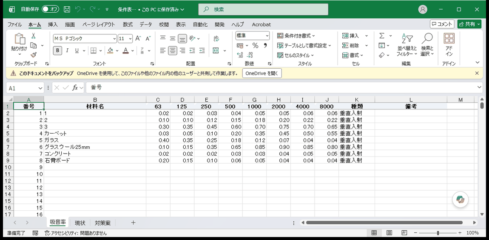

- **1000 材料ぶんの枠**がある。PJ 固有の吸音データはここに置けばよい
  （これがあれば `absorption.csv` は要らない）。
- **番号の列は `=ROW()-1`**（行の位置がそのまま材料番号）。触らない。
- ★**「種類」は必ず選ぶ**（ドロップダウン）。
  - **垂直入射**（法線入射）… 音響管（インピーダンス管）で測ったもの
  - **残響室法**（乱入射）… 残響室で測ったもの。1 を超えることがある

  残響室法の値は Paris の式で自動的に垂直入射へ変換される。
  **取り違えると吸音を大きく誤る**（残響室法 0.50 は垂直入射では 0.34 相当）。

### 4-2. その他のシート ＝ 条件 1 つ

シート 1 枚が条件 1 つで、**シート名が条件名**になる（既定では「現状」）。

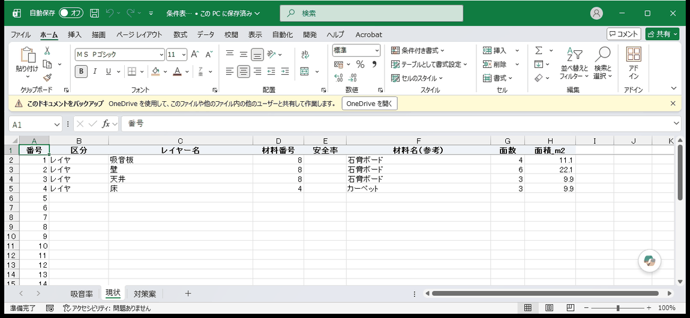

- ★**書き換えるのは「材料番号」と「安全率」の列だけ。**
  材料名は VLOOKUP の参考表示で、読むときは見ない（名前を打つと全角・半角の
  ミスタイプが起きるため）。
- **安全率**は「吸音率を見過ぎないように間引く」係数（例 0.8）。**未入力なら掛けない**。
  カタログ値に掛けてから垂直入射へ変換する。
- 面数・面積は毎回書き直される参考列。想定どおりの面が拾えているかの確認に使う。
- **条件シートに吸音率は載せない**（ミスリードを避けるため。吸音率は「吸音率」シートだけ）。
- 利用者が書いた材料番号は**絶対に上書きされない**。モデルから消えたレイヤも
  `（モデルに無し）` として残る（前の設定を見返せるように）。
- 作った体裁（列幅・書式・足した列）は計算しても壊れない（その場で直すだけ）。

例題では 2 条件を用意してある。

| レイヤ | 現状 | 対策案 |
|---|---|---|
| 床 | カーペット | カーペット |
| 壁 | 石膏ボード | 石膏ボード |
| 天井 | 石膏ボード | **グラスウール25mm**（安全率 0.8） |
| 吸音板 | 石膏ボード | **グラスウール25mm**（安全率 0.8） |

### 4-3. 条件を増やす・一括で回す

シートを複製して名前を変えるだけ（シート名が条件名）。

```powershell
python run_project.py "C:\...\プロジェクト" --conditions
```

または条件入力の**「全条件を一括 ▶▶」**。

- **結果ファイル名は「対象室名 ＋ 条件名」**になるので混ざらない。
- **2 件目以降は速い。**経路（反射面の並びと入射角）は吸音に依らないので、
  1 件目で保存した `結果/recN/<室>_経路.npz` を使い回してエネルギーだけ計算し直す。
- 最後に**条件を横に並べた比較表**（`<室>_まとめ_条件比較.csv`）と、
  Excel の「条件比較」シートができる。

> ★注意：材料の**分け方**（どのレイヤをどの材料にするか）を変えるとパッチの切れ目が
> 動くので経路も変わる。そのときは自動でやり直す。吸音率の**値**だけ変えたときは
> 使い回す。`--no-reuse` で使い回しを切れる。

---

## 5. 面を確認する（法線・吸音材）

条件入力の**「面を確認…（法線・吸音材）」**、または：

```powershell
python face_editor.py "C:\...\プロジェクト"
```

### 5-1. 法線の向き

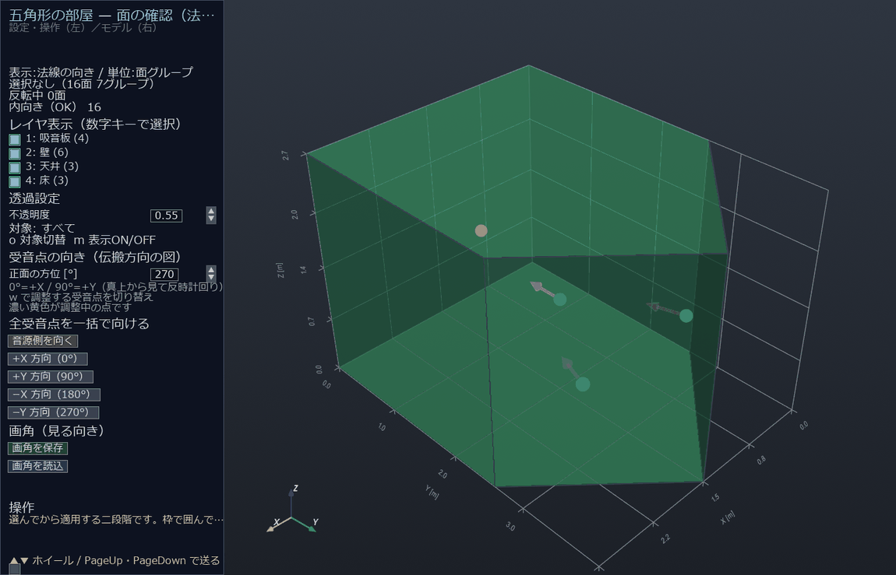

- **緑 = 内向き（OK）／赤 = 外向き（要反転）／灰 = 判定できない**。
  例題では左上に「内向き（OK） 16」と出ており、全面そろっている。
- **面は「同一平面パッチ」を 1 枚として見せる**（三角形の辺は描かない）。
  1 枚の壁が三角形に割られていても、まとめて 1 枚として選ばれる。
- 左の欄に**レイヤの一覧**（`吸音板 (4)` `壁 (6)` `天井 (3)` `床 (3)`）が出る。
  チェックを外すとそのレイヤを隠せる。**数字キー**でそのレイヤを選択できる。
- **受音点の向き**（伝搬方向の図に使う「人」の正面）もここで決める。
  「音源側を向く」「+X 方向」などの**ボタンで一括**に向けられる。
- **「画角を保存」「画角を読込」**で見る向きを `視点.json` に出し入れできる。
  名前を付けて何本でも持てる。**面の確認と結果画面で同じファイル**なので、
  モデルを見た向きのまま結果を見られる。

### 5-2. 吸音材

`m` を押すと吸音材の表示に切り替わる。

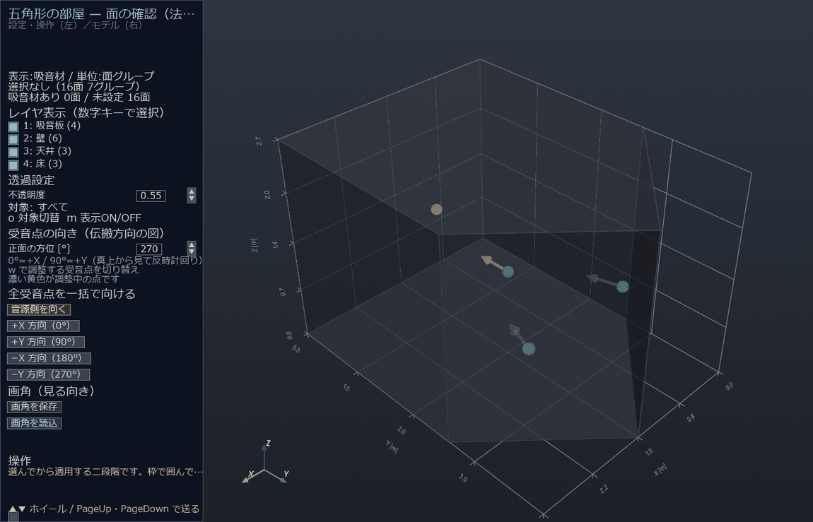

> ★**ここが「未設定 16 面」でも異常ではない。**この画面が色を付けるのは
> **面ごとに直接貼った材料**（`materials.json`）だけで、
> **条件表でレイヤに割り当てた材料は映らない**。
> レイヤで分けているふつうのモデルでは、ここは灰色のままでよい。
>
> 面ごとの割り当てを使うのは、**1 つの 3DSOLID で出来ていてレイヤで分けられない
> モデル**のとき。左の欄の材料をクリックすると、選んでいる面に貼れる。

### 5-3. 操作

**操作は「選ぶ → 適用する」の二段階。**枠で囲んだ瞬間には何も起きない。
選んだ面は橙で塗られ、外周が線で描かれる。

| キー | 動き |
|---|---|
| `r` | 枠で選ぶ（もう一度押すと解除） |
| `0` / `j` / `h` | 選択を解除 / 全部を選ぶ / 選択を反転 |
| `k` / `t` | 同じ平面の面を選ぶ / 同じ平面かつ同じレイヤ |
| `l` / 数字 | 同じ吸音材の面を選ぶ / そのレイヤを選ぶ（1〜9） |
| `y` | 面グループ ⇔ 三角形（選択の単位を切り替え） |
| `m` | 法線 ⇔ 吸音材（表示モード） |
| `i` | 選んだ面の法線を反転（選択が空なら全部） |
| `a` / `d` | 自動判定にする / CAD の巻き順に戻す |
| `n` / `o` | 法線の矢印 / 不透明度の対象を切り替え |
| `z` `x` `c` `v` | 視点（上・正面・横・等角） |
| `w` | 向きを調整する受音点を切り替え（受音点が複数のとき） |
| `g` | いまの画面を画像で保存 |
| `PageUp` / `PageDown` / ホイール | 左の欄を送る |
| `s` / `q` | **保存して閉じる** / 保存せずに閉じる |

数値の欄は Excel と同じ**スピンボックス**。枠を押すとその場で打ち込める
（`Enter` 確定 / `Esc` 取り消し、`←` `→` で桁を移動）。`t` でまとめて入力もできる。

保存すると、法線の反転指定は `normals.json`、面ごとの吸音材は `materials.json`、
受音点の向きは `project.json` に入る。
**DXF を描き直して面数が変わると、これらは使われずに警告が出る**（黙って別の面を
反転させないため）。

---

## 6. 計算する

条件入力の**「計算する ▶」**、またはコマンドラインから：

```powershell
python run_project.py "C:\...\プロジェクト"
```

進捗ウィンドウが出る。ログは `結果/<室>_<条件>_計算ログ.txt` にも残る。

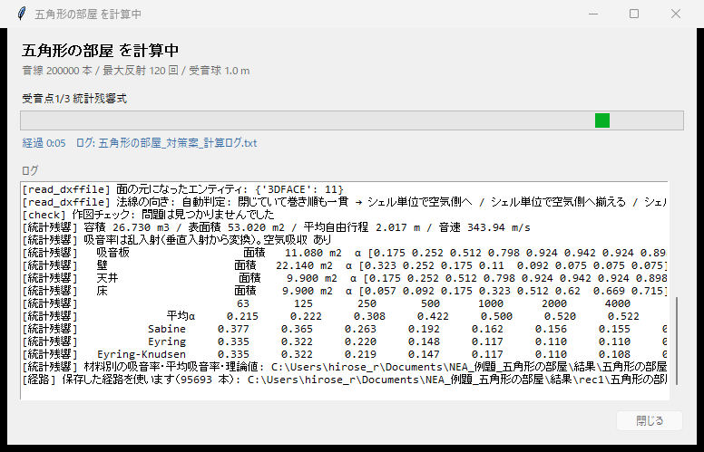

### 6-1. 途中で出るメッセージの読み方

```
[loop_noredundancy] 経路 274666 本 → 受音 26446 本 / 却下 248220 本
```
バックトレースで成り立たなかった経路が却下された数。却下が多いのは異常ではない。

```
[procedure] 最大反射回数 nref=120 に達した経路がありますが、
            その時点で -59.2 dB まで減衰しているので残響時間には影響しません
```
**反射回数が足りているかの判定。**「影響します」と出たら反射回数を増やす。

```
[reverberation] ★ 曲率が 10% を超えたバンド（63Hz）は減衰が直線でないので
                そのまま信用しないこと。
[reverberation] ★ 非線形性 ξ（ISO 3382-2）が 10 を超えたバンド（…）は
                回帰直線に乗っていません。
```
★**このバンドの残響時間は読んではいけない**という合図（第 9 章）。

### 6-2. 出てくるファイル

```
プロジェクトフォルダ/
  project.json           条件（次に開くとそのまま復元される）
  normals.json           法線の反転指定
  materials.json         面ごとの吸音材の割り当て
  条件表.xlsx            ★入力（レイヤー → 材料番号）
  視点.json              画角（見る向き）
  断面.json              音圧分布を描く断面の指定（第 8 章）
  測定点順.json          測定点の並び（`結果/recN/` の N。第 3-6 節）
  結果/
    <室>_<条件>_結果一式.xlsx        ★人が読むのはこれ（9 シート・グラフ付き）
    <室>_<条件>_まとめ_残響時間.csv   全受音点 ＋ 平均 ＋ 理論値
    <室>_<条件>_まとめ_明瞭度.csv     全受音点 ＋ 平均
    <室>_<条件>_まとめ_音圧レベル.csv 帯域別 Lp（3 列目が音源距離）
    <室>_<条件>_まとめ_STI.csv        STI と帯域別 MTI
    <室>_<条件>_吸音率と理論値.csv    材料別の吸音率 → 平均吸音率 → 残響時間理論値
    <室>_まとめ_条件比較.csv          条件を横に並べた比較（一括実行のとき）
    <室>_測定点.csv                   音源・受音点の位置と向き
    <室>_raylog.npz                   可視化用の音線軌跡
    rec1/  rec2/  rec3/               受音点ごとの詳細 CSV
      …_pulses.csv    パルス列（反射回数・到来時刻・到来方向・バンド別エネルギー）
      …_ir.csv        インパルス応答
      …_rt.csv        EDT / T20 / T30（＋ RTany）＋ 曲率 ＋ 非線形性 ξ
      …_decay.csv     減衰曲線
      …_clarity.csv   C50 / C80 / D50 / Ts
      …_spl.csv       帯域別の音圧レベル
      …_sti.csv       STI と MTI
      <室>_経路.npz   ★経路の幾何（条件をまたいで使い回す）
  図/
    <室>_points.png        測定点の配置（平面 ＋ 立面 2 方向）
    rec1/ rec2/ rec3/      受音点ごとの PNG（11 枚）
    画面/                  3D 画面から手で撮った画像・動画（計算し直しても消えない）
```

**CSV と Excel は役割が違う。**

- **CSV** … プログラムが読む（描き直し・まとめ表・他ソフトへの受け渡し）
- **Excel** … 人が読む（報告書・打ち合わせ）。まとめ表の CSV を並べ直したもの

**ファイル名の頭に「対象室名 ＋ 条件名」が付く。**
報告書やメールでフォルダの外へ出したときに、どの室・どの条件か分かるようにするため。
対象室名は DXF のファイル名（条件入力の「対象室名」欄が優先）、条件名は条件表のシート名。

### 6-3. 表の向きの約束

**表はすべて「周波数を横」に並べる。**グラフの横軸が周波数なので、それに揃えてある。
Excel でグラフを作るたびに行と列を選び直さずに済む。

意味の違う行が混ざる表（`吸音率と理論値.csv` / `spl.csv` / `sti.csv`）は**区分付き**で、
1 列目が区分、2 列目が項目、**3 列目が周波数に依らない値**（総合値・面積・距離）、
4 列目以降が周波数。

### 6-3b. RTany ― 減衰曲線をどこで読むか

**EDT / T20 / T30 は今までどおり必ず出る。**そのうえで、**自分で区間を決めて読む
1 本**を足せる。これが `RTany`。

減衰が**二段階**になる室（前半が速く減り、後半が遅く残る）では、T30 を 1 本の
直線で読むこと自体に無理がある。どこを読むかは**設計者が決めること**なので、
機械に選ばせずに手で決める口を用意してある。

| 欄（条件入力の「減衰曲線の読み方」） | 既定 | 意味 |
|---|---|---|
| RTany 開始 [dB] | -5 | 空欄にすると RTany を出さない |
| RTany 終了 [dB] | -35 | 前半だけ読むなら -15 など |
| 読み取り方 | ISO 3382 | 区間の全点に直線を当てる。2 点法も選べる |

★**既定は T30 と同じ区間**にしてある。変えるまでは T30 と同じ値が出るので、
「まだ何も決めていない」ことが数字を見れば分かる。

★**どの区間で読んだかは `rt.csv` に残る**（`RTany_start_db` / `RTany_end_db` の行）。
非線形性 ξ も他の指標と同じように出るので、**その区間が読めるかどうかも数値で分かる**
（区間を短くすると ξ は大きくなる。目安は ξ ≦ 10）。

残響時間の図では **RTany だけ破線**で描かれる。まとめ表にも並ぶ。

---

### 6-4. 音源が複数あるとき

**音源（`src` 画層の点）を 2 つ以上描くと、1 点ずつ計算する。**
ISO 3382 が音源位置ごとに測って平均する決まりなので、それに合わせてある。

置き場が 1 段深くなる（★**音源が 1 点だけなら今までと同じ**）。

```
  結果/
    <室>_測定点.csv                   ← 音源にも受音点にも依らないものは今までどおり
    <室>_<条件>_吸音率と理論値.csv
    src1/                             ← 音源 1 だけの結果
      <室>_<条件>_まとめ_*.csv ＋ 結果一式.xlsx
      rec1/ rec2/ …
    src2/                             ← 音源 2 だけの結果
    合成_平均/                         ← ここから下が「見方」（設定で選ぶ）
    合成_重ね合わせ/
    合成_重ね合わせ_時間差なし/
```

**見方は 3 通り。意味が違うので取り違えないこと。**

| 棚 | 何を表すか | 干渉 |
|---|---|---|
| `src1` / `src2` | その音源だけを鳴らしたとき | — |
| `合成_平均` | **音源位置ごとに測って平均**（ISO 3382 の作法） | 起きない |
| `合成_重ね合わせ` | **2 台を同時に鳴らした**ときの音（PA など） | 起きる |
| `合成_重ね合わせ_時間差なし` | 音源ごとに直接音を 0 秒へ揃えてから足した音 | 起きる |

- **平均**は「1 つずつ鳴らしたときの代表値」。別々の測定を平均するので干渉は出ない。
  音圧レベルだけ**エネルギー平均**（dB をそのまま平均しない）で、
  残響時間・明瞭度・STI は算術平均
- **重ね合わせ**は実際に同時に鳴らした音なので、2 つの音が干渉する。
  音圧レベルは音源が 2 つぶんなので平均より約 3 dB 大きくなる
- ★**音源ごとに出力（PWL）を変えることはできない**。いまは「同じ PWL の音源が
  同時に鳴る」扱い

計算をやり直さずに見方だけ足したいときは:

```
cd geosim
..\.venv\Scripts\python source_mix.py "C:\...\プロジェクト"
```

---

## 7. 結果を見る

### 7-1. Excel（人が読む方）

`結果/<室>_<条件>_結果一式.xlsx`。9 シート。

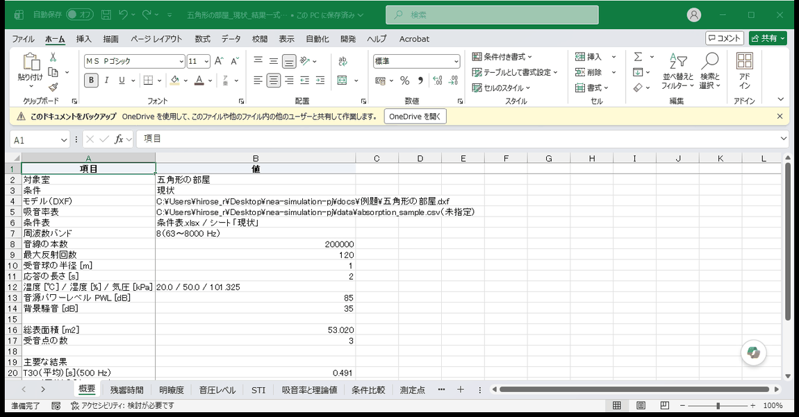

「残響時間」シートには、**全受音点 ＋ 平均 ＋ ばらつき ＋ 理論値**が 1 枚に入る。

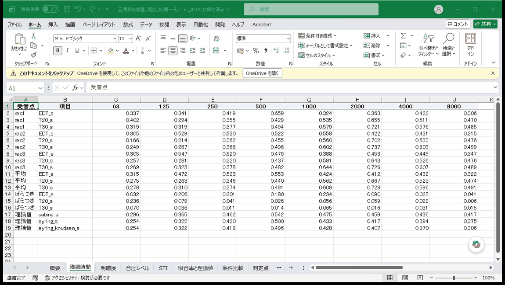

会社の雛形に流し込むこともできる（雛形の書式・グラフ・ロゴを残したまま値だけ入れる）。

```powershell
python workbook.py "C:\...\プロジェクト" --template 雛形.xlsx
```

### 7-2. 図

**測定点の配置**（`図/<室>_points.png`）。平面図 ＋ 立面 2 方向。
どれがどの点で、どちらを向いているかを後から確認するためのもの。

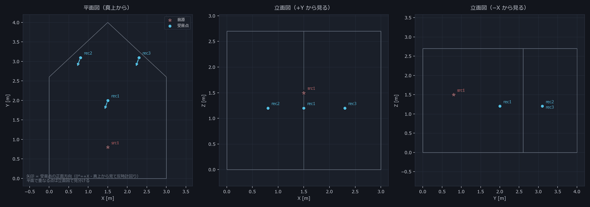

**残響時間**（`図/recN/…_reverberation.png`）。EDT / T20 / T30 と統計残響式の理論値。

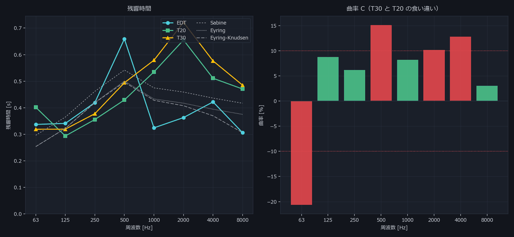

**減衰曲線**（`…_decay.png`）。Schroeder 積分。回帰直線を当てた区間が見える。

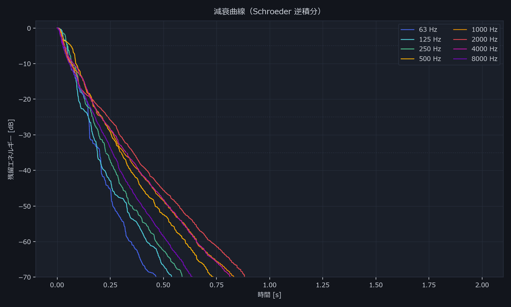

**音圧レベル**（`…_spl.png`）。帯域別の Lp と、直接音・反射音の内訳。

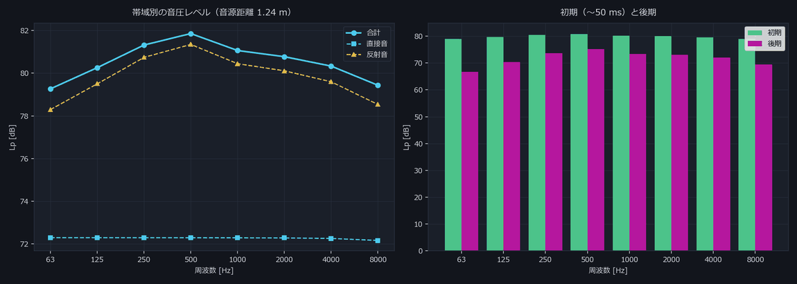

**インパルス応答**（`…_impulse_response.png`）。

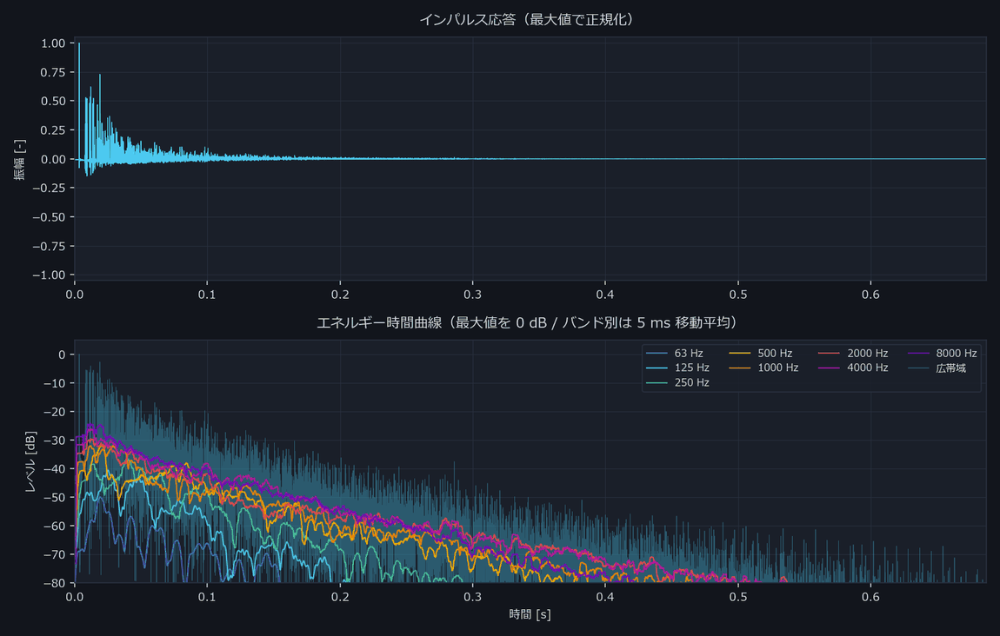

> ★**インパルス応答の図は最大値で正規化してある。**絶対振幅の校正が未了なので、
> そのままの値には意味が無い。

**伝搬方向**（`…_direction.png`）。受音点に届いたエネルギーがどちらから来たか。
**上が「人」の正面**で、鼻が上・耳が左右。

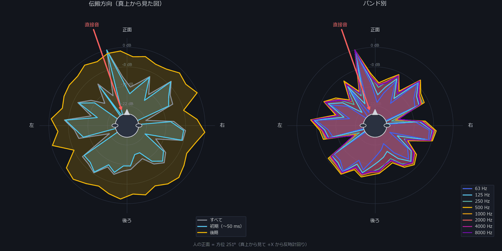

**吸音率**（`…_absorption.png`）。実際に計算に使われた材料別の吸音率。
条件表の読み違いがないかの確認に使う。

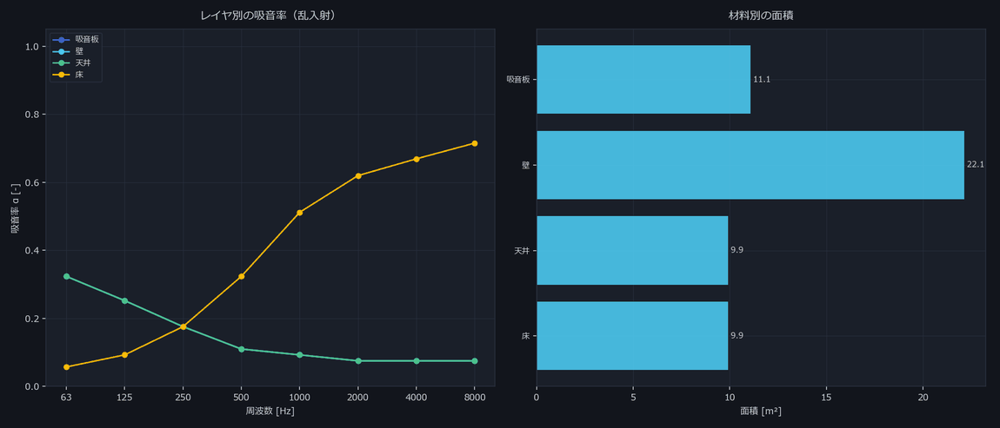

---

## 8. 結果を 3D で見る

計算が終わると自動で開く。あとから見るときは条件入力の**「前回の結果を見る」**。

左パネル上端の**タブ**（`Tab` キーでも切り替わる）で 4 つを行き来する。

### 8-1. 音線

受音した経路がどう通ったか。到来時刻で色分けしてある（**早いほど黄色、遅いほど暗い紫**。
虚音源のタブも同じ向き）。

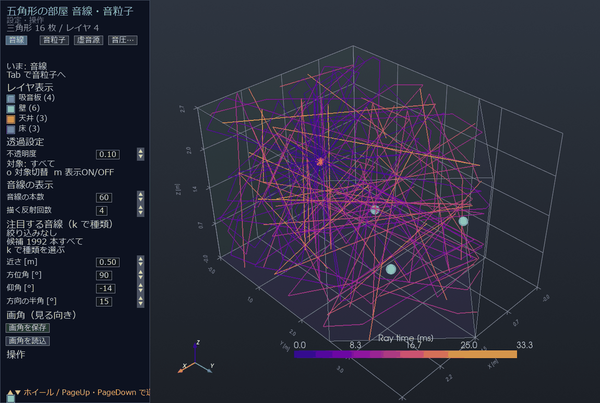

**音線の絞り込み**（`k`）は「なし / 近く / 方向 / 1 本」。
方向は方位角・仰角のスピンボックスで指定する（0° = +X、反時計回り、仰角 0 が水平）。
**出射方向で見る**（途中の向きだと反射のたびに変わって絞れない）。

### 8-2. 音粒子

音が広がっていく様子。`space` で再生／停止、`←` `→` でコマ送り。

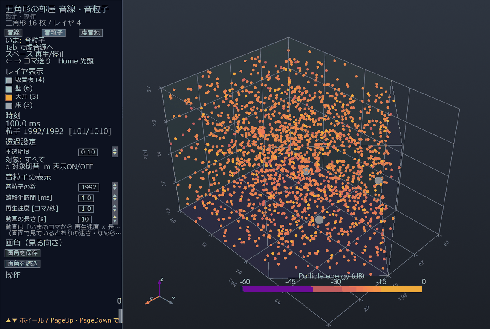

`b` で**動画（MP4）**を保存できる。iPad でも再生・停止できる形式。
**画面をそのまま「長さ」秒ぶん録ったもの**で、コマ数 = 再生速度 × 長さ。
全部を早送りで見たいときは再生速度を上げる。

### 8-3. 虚音源

受音点から見た虚音源の位置。**反射回数の「開始」と「終了」で絞る**
（同じ値にすれば「N 回目のみ」）。

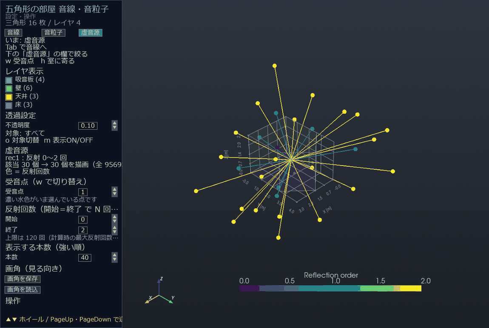

> ★**室が点に見えるのは正常。**高次の虚音源は室の外へ遠く離れるので、
> 全部が入るように引くと室が小さくなる。`h` で室に寄れる。
> 描いているのは**受音した経路の虚音源だけ**（鏡像として作れる全部ではない）。

### 8-4. 音圧分布

`mode_shape.py` が作った断面（第 9-3 節）。作っていなければタブは出ない。

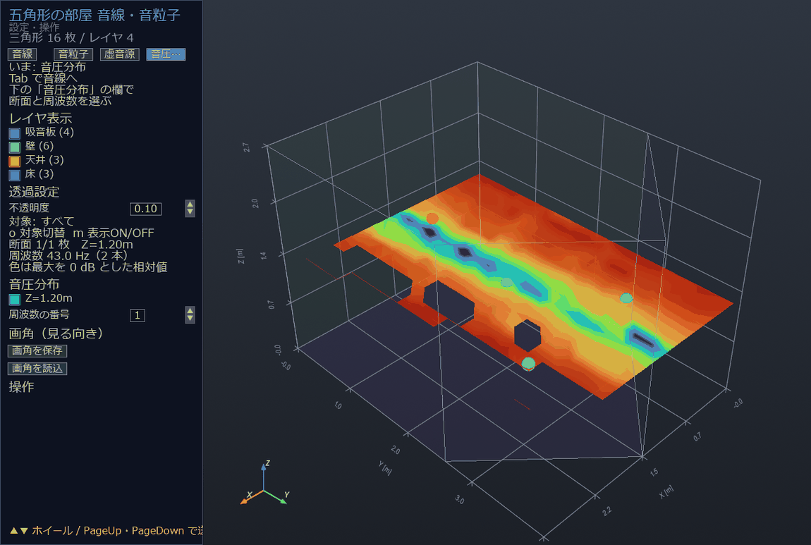

例題は 43 Hz。室の中央あたりに節（青い帯）が見える。
**まだらに欠けているのは音線から拾っているため**（その点に届く経路が
見つからなかった格子点）。なめらかな分布が要るときは第 9-3 節の `box` 法を使う。

### 8-4b. レイヤの表示を一括で切り替える

左のパネルの先頭に **「レイヤを全表示」「レイヤを全非表示」「この番号のレイヤだけ表示」**
がある（**面の確認画面と結果画面のどちらにもある**）。

画層が多いモデル（実案件では 22 種）で「床だけ見る」をやるとき、
1 つずつ消すと 21 回のクリックが要る。**全非表示 → 番号で 1 つ**が 2 操作で済む。

- 番号は左のパネルのレイヤ名の頭に付いている数字
- **数字キーは 1〜9 まで**（10 個目以降は「レイヤ番号」の欄で指す）

---

### 8-5. キー操作

| キー | 動き |
|---|---|
| `Tab` | タブを切り替える |
| `space` | 音粒子の再生 / 停止 |
| `←` `→` / `Home` | 1 コマ戻す・進める / 先頭へ |
| `k` / `j` / `0` | 絞り込みの種類 / 基準点 / 絞り込みを解除 |
| `p` | 点を拾う（任意） |
| `w` / `h` | 虚音源：受音点を切り替え / 室に寄る |
| `z` `x` `c` `v` | 視点（上・正面・横・等角） |
| `r` | いま描いているものが全部入るように引く |
| `g` / `b` | 画像で保存 / **動画（MP4）で保存** |
| `q` | 閉じる |

**画角を保存 / 読込**（左の欄のボタン）＝ 条件を変えて計算し直しても同じ向きで見比べられる。
条件を変えると画面は開き直しになるので、**保存しておかないと毎回向きが変わって
絵を並べても比べられない**。

---

## 9. 別ルートの道具（ふだんの出力には入らない）

いずれも**計算はやり直さない**（保存済みのパルス列や結果 CSV を読むだけ）。

### 9-1. 逆二乗則の評価（半無響室・無響室の確認）

```powershell
python inverse_square.py "C:\...\プロジェクト"
```

- 測線は**受音点のレイヤ**（`rec1` / `rec2` / `rec3`）で分ける。
- 基準の高さは**最小二乗**（傾きは −20log10 r に固定）。
- 許容偏差は **JIS Z 8732**（≦630 Hz ±2.5 / 800〜5000 Hz ±2.0 / ≧6300 Hz ±3.0）。
- **A（エネルギー和）と B（位相を含む複素和・参考）の両方**を出す。
  図では A が実線・B が細い破線。
  ★B の**山谷の位置は当てにならない**（反射の位相ずれを 0 と仮定しているため）。
  振れ幅の目安として見る。

報告書（Markdown ＋ PDF）まで作るなら `python report_inverse_square.py "<プロジェクト>"`。

### 9-2. 伝達関数（干渉が見える形・モード分布の確認）

```powershell
python frequency_response.py "C:\...\プロジェクト" --low 20 --high 250 --step 0.5
```

剛な面（吸音を付ける前）の形状検討で使う。パルス列から複素和で H(f) を作る。

- ★**周波数分解能は「残した最長経路」で決まる**（Δf ≈ c / L_max）。
  刻みを細かくしてもそれ以上は出ない。図と端末に実力値が出る。
- 固有周波数（直方体とみなした目安）とシュレーダー周波数も出る。
- ★回折は解いていないので、**低域は「傾向を見る道具」**。

### 9-3. 音圧分布（モード形状）を断面で塗る

まず断面を決める。プロジェクト直下の `断面.json` に**1 枚 = 1 行**で並べる。

```powershell
python section.py "C:\...\プロジェクト" --create      雛形を作る
```

書き方は 2 通りだけ。

```json
{"name": "床上1.2m", "plane": "z", "at": 1.2}
{"name": "客席中心線", "through": [[2.0, 1.0], [2.0, 9.0]]}
```

`through` は**平面図に引いた測線を含む鉛直面**。傾いた面（点＋法線）は扱わない。

```powershell
python mode_shape.py "C:\...\プロジェクト" --frequency 43
python mode_shape.py "C:\...\プロジェクト" --sweep 20:100:5
```

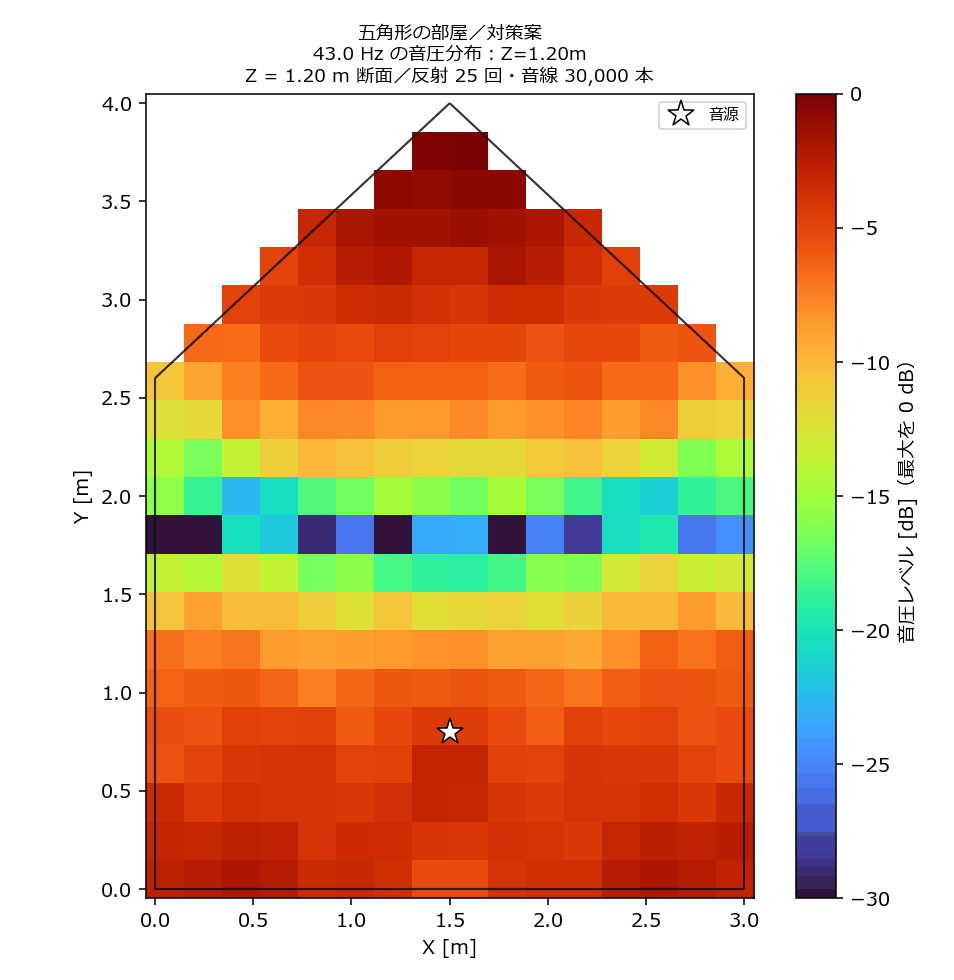

- **やり方は 2 つ**（`--method`）。`box` は直方体の虚音源を式で並べる（**なめらか**）、
  `rays` は音線から拾った経路を使う（**形は自由だがまだらになる**）。`auto` は箱なら `box`。
  例題の五角形は箱でないので `rays` になる。
- ★**重い。**断面 × 周波数のぶんだけ格子点を受音点として追跡する。
  最初は 1 断面・粗い格子で試すこと
  （例：`--plane z --at 1.2 --spacing 0.2 --rays 30000 --nref 25 --radius 0.6`）。
- ★**完全に剛（α = 0）にしない**（既定 0.02）。減衰が無いと級数が収束せず、
  打ち切る位置で値が変わる。
- **色の基準は周波数ごとに全断面で共通**（断面どうしを比べられるように）。

### 9-4. その他

```powershell
python summary.py "C:\...\プロジェクト"        まとめ表だけ作り直す
python workbook.py "C:\...\プロジェクト"       Excel だけ作り直す
python view_camera.py "C:\...\プロジェクト"    保存した画角の一覧を見る
python view_images.py "C:\...\プロジェクト"    虚音源だけを単独で見る
python view_model_gui.py "<DXF>"              モデルだけを 3D で見る
python view_model.py "<DXF>"                  HTML + WebGL を書き出す（依存なし・共有向き）
```

---

## 10. 条件を比べる（例題の結果）

例題を「現状」と「対策案」の 2 条件で回すと、`<室>_まとめ_条件比較.csv` と
Excel の「条件比較」シートができる。3 受音点の平均は次のとおり。

| 指標 | 条件 | 63 | 125 | 250 | 500 | 1k | 2k | 4k | 8k |
|---|---|---|---|---|---|---|---|---|---|
| T30 [s] | 現状 | 0.28 | 0.31 | 0.37 | 0.49 | 0.61 | 0.73 | 0.60 | 0.49 |
| T30 [s] | 対策案 | 0.32 | 0.28 | 0.30 | 0.36 | 0.35 | 0.36 | 0.27 | 0.29 |
| C50 [dB] | 現状 | 9.7 | 3.3 | 2.7 | 3.6 | 6.7 | 6.9 | 7.3 | 9.1 |
| C50 [dB] | 対策案 | 7.3 | 3.4 | 8.7 | 12.6 | 24.2 | 21.6 | 20.7 | 21.4 |
| Lp [dB] | 現状 | 77.1 | 81.4 | 82.8 | 83.5 | 82.6 | 82.1 | 81.8 | 80.7 |
| Lp [dB] | 対策案 | 78.0 | 81.4 | 78.7 | 76.1 | 75.8 | 74.8 | 75.1 | 74.9 |

STI は **現状 0.764 → 対策案 0.929**。
天井と吸音板をグラスウールにすると、500 Hz 以上の残響が半減し、音圧レベルも 7 dB 下がる。

---

## 11. 数値を信用してよいかのチェックリスト

計算が通っても、条件が足りていなければ数字は当てにならない。
**報告に使う前に、次を必ず確認すること。**

| # | 見るところ | 合格の目安 |
|---|---|---|
| 1 | **受音球の半径** | 半径を変えても残響時間が動かない（収束している） |
| 2 | **最大反射回数** | 「打ち切り時点で −○○ dB まで減衰しているので影響しません」と出ている |
| 3 | **非線形性 ξ**（`rt.csv`） | **ξ ≦ 10**（ISO 3382-2）。超えたバンドは回帰直線に乗っていない |
| 4 | **曲率 C**（`rt.csv`） | `(T30/T20 − 1)×100`。10% を超えたら減衰が 2 段階になっている |
| 5 | **容積** | `吸音率と理論値.csv` の容積が図面と合っている。自由端があれば「目安」 |
| 6 | **吸音率の種類** | 条件表「吸音率」シートの「種類」が正しい（垂直入射 / 残響室法） |
| 7 | **理論値との比** | `T30 / Eyring-Knudsen` が極端でない。極端なら 1〜3 を疑う |
| 8 | **面が拾えているか** | 総表面積・レイヤ別面積が図面と合っている |

### 例題での読み方（実際の数字）

`結果/rec1/五角形の部屋_現状_rt.csv` の抜粋。

| 項目 | 63 | 125 | 250 | 500 | 1k | 2k | 4k | 8k |
|---|---|---|---|---|---|---|---|---|
| T30 [s] | 0.319 | 0.319 | 0.377 | 0.494 | 0.579 | 0.721 | 0.576 | 0.485 |
| ξ(T30) | 34.5 | 27.6 | 7.8 | 12.0 | 5.7 | 21.0 | 7.7 | 1.2 |
| 曲率 [%] | −20.7 | 8.8 | 6.2 | 15.1 | 8.2 | 10.2 | 12.8 | 3.1 |

- **63・125 Hz は ξ が 27〜35** で、曲率も 63 Hz で −20.7%。
  **この 2 バンドの残響時間は読まない。**低域は波長が室寸法に近く、
  そもそも幾何音響が成り立ちにくい。
- **2 kHz も ξ = 21.0**。ここは理論値（Eyring-Knudsen 0.407 s）に対し
  T30 が 0.72 s と 1.8 倍あり、両方が「拡散音場になっていない」ことを示している。
  例題は**吸音が床（カーペット）に偏っている**ので、床をかすめる経路だけが
  長く残る。**減衰が本当に 2 段階になるのが正しい**。
- したがって例題では、**500 Hz 前後のバンドを主に読む**のが妥当。

★ 3・4 が引っかかっても、**必ずしも計算ミスではない**。小さい室・平行面・面ごとに
吸音率が大きく違う場合は、上のように**減衰が本当に 2 段階になる**。そのときは
「拡散音場を前提にした残響時間という指標が、そもそもこの室に合っていない」と読む。

---

## 12. よくあるつまずき

| 症状 | 原因と対処 |
|---|---|
| 「面が 1 枚も読めません」 | DXF が REGION / 3DSOLID。`python dxf_faces.py <DXF>` で面に変換する |
| 「吸音率が未指定のレイヤ → 0.1 を使用」 | 条件表でそのレイヤに材料番号を入れていない |
| 残響時間が理論値よりかなり短い | 受音球の半径か最大反射回数の不足（第 11 章の 1・2） |
| 残響時間が理論値よりかなり長い | 拡散音場になっていない可能性。ξ と曲率を見る（第 11 章の 3・4） |
| 音圧レベルが 30 dB ずれる | 気圧に Pa を入れている。**kPa**（101.325）で入れる |
| 統計残響式が出ない | モデルが閉じておらず容積が決まらない。条件入力の「室容積」に入れる（床面積 × 天井高で可） |
| 面の確認で吸音材が全部「未設定」 | 異常ではない（第 5-2 節）。レイヤの材料は条件表で決まる |
| 「面を確認」のボタンが見えない | ウィンドウが小さい。横に伸ばすか最大化する |
| 法線の反転が効かない | DXF を描き直して面数が変わった。`normals.json` は使われず警告が出る。貼り直す |
| 後処理ツールが「結果が見つかりません」 | 条件（シート）を選ばずに計算した。シートを選んで計算し直す（第 3-1 節） |
| STI が出ない | 1/3 オクターブで回している。**STI はオクターブ 125〜8k が前提**（IEC 60268-16）なので飛ばす |
| 3D 画面が落ちる・真っ黒 | GPU の都合。`view_model.py`（HTML 版）で代用できる |
| `mode_shape.py` が終わらない | 断面 × 周波数が多すぎる。1 断面・粗い格子から試す（第 9-3 節） |

---

## 13. 覚えておくと早いこと

- **同じ計算を条件だけ変えるなら一括で回す。**2 件目以降は経路を使い回すので速い。
- **図だけ描き直したい**ときは「前回の結果を見る」（`run_project.py --redraw`）。
  音線追跡はやり直さないので数秒で終わる。
- **画角を保存しておく。**条件違いの絵を並べて比べるには、これが要る。
- **3D 画面から撮った画像・動画は `図/画面/` に入る。**計算し直しても消えない。
- **1/3 オクターブでも回せる**（`band_width` = `1/3`、`band_start` で最低バンドを指定）。
  ただし STI は出ない。

---

## 14. コマンド早見表

```powershell
cd C:\...\nea-simulation-pj\geosim
#（以下 python = ..\.venv\Scripts\python）

# --- 通し ---
python app.py                                     GUI（条件入力から）
python app.py "<プロジェクト>"                     そのプロジェクトを開く
python app.py "<プロジェクト>" --run               入力画面なしですぐ計算
python run_project.py "<プロジェクト>"             CLI で計算
python run_project.py "<プロジェクト>" --conditions 全条件を一括
python run_project.py "<プロジェクト>" --redraw     図だけ描き直す
python run_project.py "<プロジェクト>" --no-reuse   経路を使い回さない

# --- モデルの確認 ---
python read_dxffile.py "<DXF>"                    容積・面積・音源・受音点
python open_edges.py "<プロジェクト or DXF>"       閉じているかを確認
python dxf_faces.py "<DXF>"                       REGION / 3DSOLID を面に変換
python face_editor.py "<プロジェクト>"             法線・吸音材の確認と修正

# --- 出力の作り直し（計算はしない）---
python summary.py "<プロジェクト>"                 まとめ表
python workbook.py "<プロジェクト>" --template 雛形.xlsx   Excel

# --- 別ルート ---
python inverse_square.py "<プロジェクト>"          逆二乗則の評価
python report_inverse_square.py "<プロジェクト>"   その報告書（MD + PDF）
python frequency_response.py "<プロジェクト>" --low 20 --high 250 --step 0.5
python section.py "<プロジェクト>" --create        断面.json の雛形
python mode_shape.py "<プロジェクト>" --plane z --at 1.2 --frequency 43

# --- 見る ---
python view_images.py "<プロジェクト>"             虚音源
python view_directions.py --rays 200000           音線の飛び方
python view_model_gui.py "<DXF>"                  モデル（ネイティブ）
python view_model.py "<DXF>"                      モデル（HTML + WebGL）

# --- 検証・資料 ---
cd ..
.\.venv\Scripts\python tests\test_geosim.py       829 件
.\.venv\Scripts\python docs\build_pdf.py          docs の PDF を作り直す
```
