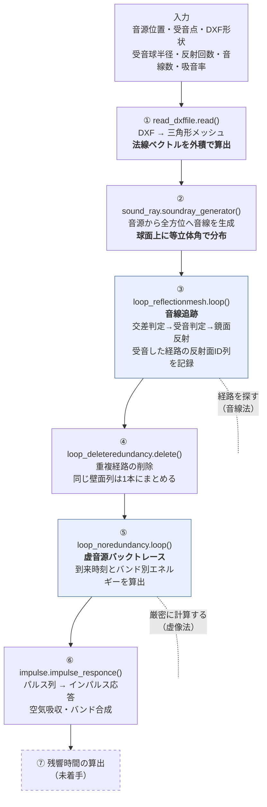

# 幾何音響シミュレーション 技術説明書

— プログラムのフローと数式の解説 —

最終更新: 2026-08-12（HBN240018）

## 0. この資料について

`geosim/` が何をしているかを、**プログラムの流れ**と**式の意味**の両面から解説する資料です。
「この式は法線を出している」「この式は法線と音線から交点を求めている」というレベルまで噛み砕いて書いています。

- 対象コード: `geosim/`（Fortran 3 ファイルからの移植版）
- 理論的な下敷き: **豊田政弘『建築音響物理学』関西大学出版部 2.2 節（幾何音響理論）**
  移植元 Fortran コードは、事実上この本の 2.2 節の実装です。以下、式番号は断りがなければこの本のもの。
  抜粋 PDF の場所は `参考文献/README.md` を参照（PDF は Git 管理外）。
- 実装状況は `PROGRAM_STRUCTURE.md`、残作業は `TODO.md` を参照。

### 手法の位置づけ

本 PJ は **音線法（ray tracing）と虚像法（image source method）を組み合わせた 2 段構え**です。

| | 役割 | 長所 | 短所 |
|---|---|---|---|
| 音線法 | 「どの壁をどの順に反射する経路が受音点に届くか」を**探す** | 任意形状で使える | 受音球の大きさ次第で経路を取りこぼす／偽検出する（図2.16, 2.17） |
| 虚像法 | 見つかった経路について、到来時刻とエネルギーを**正確に計算する** | 幾何学的に厳密 | 虚音源が指数的に増え、総当たりは非現実的（式2.66） |

音線法で経路の「当たり」をつけ、虚像法で厳密に計算し直す。これによって
「音線法の精度の甘さ」と「虚像法の計算量爆発」の両方を回避しています。
音線法の段階では**エネルギーを計算していない**のがポイントで、経路探索に徹しています。

---

## 1. 全体フロー



書籍の図2.15（音線法のフローチャート）が ①〜③、図2.20（虚像法のフローチャート）が ⑤〜⑥ に対応します。

---

## 2. 記号の約束

以降で使う記号です。コード上の変数名・Fortran の変数名も併記します。

| 記号 | 意味 | Python | Fortran |
|---|---|---|---|
| $\mathbf{p}_0$ | 音線の**基点**（未反射なら音源位置、反射後は直前の反射点） | `soundray_comesfrom` | `vini` |
| $\mathbf{v}$ | 音線の**進行方向単位ベクトル** | `sound_ray` | `vray` |
| $\mathbf{n}$ | 壁面の**内向き単位法線ベクトル** | `mesh[j].normal` | `vwnm(j,:)` |
| $\mathbf{x}_1,\mathbf{x}_2,\mathbf{x}_3$ | 三角形メッシュの頂点座標 | `mesh[j].vertexes` | `vwpt(surf(j,2..4),:)` |
| $t$ | 交点パラメータ（$\mathbf{p}_0$ から交点までの距離） | `t` | `temp` |
| $\mathbf{q}$ | 音線と壁面の**交点** | `node` | `node` |
| $\mathbf{x}_r$ | 受音点 | `reciever_point` | `(rcvx, rcvy, rcvz)` |
| $r_c$ | 受音球の半径 | `sphere_radius` | `rcvr` |
| $\alpha_\mathrm{n}$ | **垂直入射**吸音率（バンド別） | `absorption_coefficient` | `absper(id, 1..6)` |
| $\theta$ | 入射角（法線となす角） | — | — |
| $E$ | 音線のエネルギー（バンド別） | `soundray_energy` | `enertmp(6)` |
| $c$ | 音速 [m/s] | `sound_velocity` | `c0` |

**ベクトルはすべて 3 次元の列ベクトル**、$\mathbf{a}\cdot\mathbf{b}$ は内積、$\mathbf{a}\times\mathbf{b}$ は外積です。

> **なぜ法線を「内向き」に揃えるのか**
> 室内音響では音は閉じた空間の内側を飛びます。法線を室内側に揃えておくと、
> 「音線が壁に向かっている」という判定が $\mathbf{v}\cdot\mathbf{n}<0$ という**符号ひとつ**で書けます（3.1 節）。
> 向きがバラバラだと面ごとに場合分けが必要になります。

---

## 3. ① 室形状の読み込みと法線ベクトル

対応コード: `read_dxffile.py` ／ `mesh.py`　│　書籍: p.79 図2.12
CAD 側の作図ルールは `docs/DXFデータの作り方.md` を参照

### 3.1 三角形メッシュ

室形状を三角形の集まりで表します。三角形に限定するのは、
「平面であることが常に保証される」「頂点 3 点で法線が一意に決まる」ためです。
四角形以上だと 4 点が同一平面上にない場合があり、交差判定が破綻します。

### 3.2 法線ベクトルを外積で求める ← **「この式は法線を出している」**

頂点 $\mathbf{x}_1$ を基準に、三角形の 2 辺を表すベクトルを作ります。

$$\mathbf{v}_{12} = \mathbf{x}_2 - \mathbf{x}_1, \qquad \mathbf{v}_{13} = \mathbf{x}_3 - \mathbf{x}_1$$

この 2 本の**外積**が法線です。

$$\mathbf{n}' = \mathbf{v}_{12} \times \mathbf{v}_{13}
= \begin{pmatrix}
v_{12,y}\,v_{13,z} - v_{12,z}\,v_{13,y} \\
v_{12,z}\,v_{13,x} - v_{12,x}\,v_{13,z} \\
v_{12,x}\,v_{13,y} - v_{12,y}\,v_{13,x}
\end{pmatrix}$$

**外積の意味**：外積は「2 本のベクトルが張る平面に垂直で、右ねじの向き」のベクトルを返します。
$\mathbf{v}_{12}$ も $\mathbf{v}_{13}$ も三角形の面内にあるので、それに垂直＝**面の法線**になります。

長さを 1 に正規化します。

$$\mathbf{n} = \frac{\mathbf{n}'}{\lVert \mathbf{n}' \rVert}$$

**正規化する理由**：以降の式で $\mathbf{n}$ を単位ベクトルとして扱うためです。
たとえば $\mathbf{n}\cdot\mathbf{a}$ が「$\mathbf{a}$ の法線方向成分の長さ」そのものになり、式が簡単になります。

**押さえておく点が 3 つ**あります。

1. **向きは頂点の順序で決まる**。$\mathbf{x}_1\to\mathbf{x}_2\to\mathbf{x}_3$ が反時計回りに見える側が $\mathbf{n}$ の向きです。
   CAD 側の頂点順序が揃っていないと法線が外向きになる面が混ざるので、閉空間なら内向きに揃える必要があります。
2. **$\lVert\mathbf{n}'\rVert = 0$ なら縮退面**。3 点が一直線上に並んでいる（＝面積ゼロの三角形）ケースで、
   正規化でゼロ除算になります。元 Fortran コードはここで面を捨てています。
3. **外積の大きさは平行四辺形の面積**。$\lVert\mathbf{n}'\rVert / 2$ が三角形の面積になるので、
   吸音力の計算などで面積が要るときはここで取れます。

### 3.3 法線の向きと、開いた形状の扱い

**面は片側だけ反射します。** 音線が壁に当たったと判定されるのは
$\mathbf{v}\cdot\mathbf{n}<0$（法線に向かって進んでいる）のときだけなので、
**法線の裏側から来た音線はその面を通り抜けます**（3.1 節）。

この片側性のおかげで、**閉じた室である必要がありません**。

| 形状 | 法線の向き | 挙動 |
|---|---|---|
| 閉じた室 | 全部を室内向きに揃える | 音線が内部で反射を繰り返す |
| **一面だけの反射板** | **音源側へ向ける** | **直接音＋1 回反射音が得られる。反射後の音線は飛び去り、当たる壁がなくなった時点で追跡が打ち切られる** |

一面だけの壁で「直接音と 1 回反射音だけが到来する状況」を検証できるのはこの仕組みによります。

**開いた形状では法線の向きが結果を左右します。**向きが逆だとその面では一切反射せず、
反射音が黙って消えます。ここが最も間違いやすい点です。

#### 閉じているかの自動判定

閉じた多面体では**すべての辺がちょうど 2 枚の三角形に共有されます**。
そこで「1 枚にしか属さない辺（開いた辺）」の本数を数えれば閉/開が判定できます。

- **閉じている（開いた辺 0 本）** … **符号付き体積**で向きを判定して揃える

$$V = \frac{1}{6}\sum_{\text{面}} \mathbf{x}_1 \cdot (\mathbf{x}_2 \times \mathbf{x}_3)$$

  各三角形と原点が作る四面体の符号付き体積の和です。閉じた曲面で巻き順が一貫していれば、
  $V>0$ なら法線が外向き、$V<0$ なら内向き。外向きなら全部反転すればよい、と決まります。

  **重心との内積で面ごとに判定する方法より優れている点**は、**凸形状に限定されない**ことです。
  重心方式は L 字型の室のように重心が壁の裏側に来る形状で誤判定しますが、
  符号付き体積は閉じていて巻き順が一貫していればよいので非凸でも正しく働きます。

  `test.dxf`（2×3×1 m の直方体）では $V = -6.0000\ \mathrm{m^3}$ となり、
  室容積 $6\ \mathrm{m^3}$ の負値なので CAD 時点ですでに内向きだったと厳密に確認できます。

- **開いている** … **何もしません**（CAD の巻き順のまま）。
  体積が意味を持たないので、勝手に反転すると反射音を失う恐れがあります。
  反射が出ない場合は `orient_normals='toward'`（面ごとに音源側へ向ける）を使います。

なお、法線ベクトルだけを反転すれば済み、頂点の並び順を直す必要はありません。
5.4 節の内外判定は外積の内積の符号を見ているだけで、巻き順を反転しても値が変わらないためです。

> 元コード（`backtrace.f90` 276〜282 行）は `ynnmrev` という y/n フラグで全法線を反転するかを
> ユーザーに聞くだけでした。自動判定と `'toward'` は Python 版で追加した機能です。
> 詳細は `docs/DXFデータの作り方.md` 3 節。

---

## 4. ② 音源からの音線生成

対応コード: `sound_ray.soundray_generator()`（元コード 318〜326 行）
書籍: p.78 図2.11、補遺 A.15（立体角）

### 4.1 何をしたいか

無指向性音源を表現するには、音源から**全方位に均等に**音線を飛ばす必要があります（書籍 図2.11）。
ここでいう「均等」とは**等立体角**、つまり球面上で音線の到達点が一様分布になることです。

緯度・経度を単純に等分割すると極付近に音線が密集してしまうので、それではいけません。

### 4.2 Fibonacci 螺旋（黄金角法）

コードでは次の式で $N$ 本の単位ベクトルを作っています（$i = 0, 1, \ldots, N-1$）。

$$z_i = \frac{2i}{N} - 1 + \frac{1}{N}$$

$$\varphi_i = i \cdot \Delta, \qquad \Delta = \pi(3 - \sqrt{5}) \approx 2.3999\ \mathrm{rad}\ (\approx 137.5^\circ)$$

$$\mathbf{v}_i = \begin{pmatrix}
\sqrt{1 - z_i^2}\,\cos\varphi_i \\
\sqrt{1 - z_i^2}\,\sin\varphi_i \\
z_i
\end{pmatrix}$$

**なぜこれで等立体角になるのか**（2 つの仕掛け）

- **$z$ を等間隔に刻んでいる**のがポイントです。半径 1 の球を高さ $z$ で薄く輪切りにしたとき、
  その帯の面積は $2\pi\,\Delta z$ で、**$z$ の位置によらず一定**です（アルキメデスの球帯の定理）。
  つまり $z$ を等間隔にとれば、それだけで立体角が等分されます。極に密集しません。
- **$\Delta$ が黄金角**（$\pi(3-\sqrt5)$）であることで、経度方向がどこまで回しても既出の角度と重ならず、
  螺旋状に隙間なく埋まります。黄金比が無理数であることを使った、ヒマワリの種と同じ配置です。

$\sqrt{1-z_i^2}$ は、高さ $z_i$ で球を切ったときの**断面円の半径**です。
その円周上を角度 $\varphi_i$ の方向に取る、というのが $x, y$ 成分の意味です。

$z_i$ の式の $+\,1/N$ は、$z$ が $-1$ や $+1$（真南・真北の極）にぴったり来ないよう半目盛ずらすためのものです。
極では断面円が点に潰れてしまうので、それを避けています。

> **Fortran 版のバグ**：元コードは $i = 1, \ldots, N$（1 始まり）でこの式を使っているため、
> $i = N$ のとき $z = 1 + 1/N > 1$ となり $\sqrt{1-z^2}$ が NaN になります。
> Python 版は 0 始まりなので $z \in [-1+1/N,\ 1-1/N]$ に正しく収まります（2026-08-12 検証済み）。

> **代替手法**：`参考文献/02_音線生成・方向離散化/` に「軸対称等立体角26面体を用いた全方位の離散化」があります。
> 音線数が少ないときは Fibonacci 螺旋より均等性が良い可能性があり、比較検討の余地があります。

---

## 5. ③ 音線追跡

対応コード: `loop_reflectionmesh.py`（元コード 524〜717 行）／ `mesh_method.py` ／ `receiver_sphere.py`
書籍: p.79〜85

**この節が本 PJ の心臓部**です。ループ構造は 3 重になっています。

```
音線ループ i = 1 … N本            ← 音源から出る音線を1本ずつ
  反射回数ループ k = 0 … nref      ← その音線が反射を繰り返す
    壁面ループ j = 1 … 面数        ← どの壁に当たるかを全面で調べる
      5.1 向き判定 → 5.2 平面の式 → 5.3 交点t → 5.4 内部判定 → 5.5 最寄り面
    5.6 受音判定
    5.7 鏡面反射して次へ（当たる壁がなければ打ち切り）
```

### 5.1 音線が壁に向かっているか ← 背面カリング

$$\mathbf{v}\cdot\mathbf{n} < 0$$

**意味**：内積は $\mathbf{v}\cdot\mathbf{n} = \lVert\mathbf{v}\rVert\lVert\mathbf{n}\rVert\cos\phi = \cos\phi$
（どちらも単位ベクトル）。法線は室内向きなので、音線が壁に向かって進んでいるとき
$\mathbf{v}$ と $\mathbf{n}$ は逆向き寄りになり、$\cos\phi < 0$ になります。

逆に $\mathbf{v}\cdot\mathbf{n} \ge 0$ なら、その壁は音線の**裏側を向いている**か平行なので、
交差の計算をするまでもなく除外できます。全面に対して交点を計算するのは無駄なので、
ここで安く足切りしています（コンピュータグラフィックスでいう背面カリング）。

なお、この後の交点パラメータの式では $\mathbf{v}\cdot\mathbf{n}$ が**分母**に来るので、
この判定はゼロ除算（音線が壁と平行なケース）を防ぐ役割も兼ねています。

### 5.2 壁面を含む平面の方程式

平面は次の式で表せます。

$$\mathbf{n}\cdot\mathbf{x} + d = 0 \qquad \text{つまり}\qquad n_x x + n_y y + n_z z + d = 0$$

定数 $d$ は、平面上の点（頂点なら何番でもよい）を代入して決めます。

$$d = -\,\mathbf{n}\cdot\mathbf{x}_1$$

**意味**：点 $\mathbf{x}$ が平面上にある条件は、「基準点 $\mathbf{x}_1$ からのベクトル $\mathbf{x}-\mathbf{x}_1$ が
法線と直交すること」です。式にすると

$$\mathbf{n}\cdot(\mathbf{x}-\mathbf{x}_1) = 0 \quad\Longleftrightarrow\quad \mathbf{n}\cdot\mathbf{x} - \mathbf{n}\cdot\mathbf{x}_1 = 0$$

これがまさに $d = -\mathbf{n}\cdot\mathbf{x}_1$ とおいた形です。頂点はどれを使ってもよいのは、
3 頂点すべてが同じ平面上にあるからです。

$\mathbf{n}$ が単位ベクトルのとき、$\mathbf{n}\cdot\mathbf{x} + d$ は**点 $\mathbf{x}$ から平面までの符号付き距離**になります。
これが次の式で効いてきます。

対応コード: `mesh_method.parameter_d()`

### 5.3 音線と平面の交点を求める ← **「法線と音線から交点を求めている」式**

音線を直線としてパラメータ表示します（$t$ は基点からの距離）。

$$\mathbf{x}(t) = \mathbf{p}_0 + t\,\mathbf{v}$$

これを平面の方程式に代入します。

$$\mathbf{n}\cdot(\mathbf{p}_0 + t\,\mathbf{v}) + d = 0$$

$t$ について解くと、

$$\boxed{\ t = -\,\frac{\mathbf{n}\cdot\mathbf{p}_0 + d}{\mathbf{n}\cdot\mathbf{v}}\ }$$

交点座標は $t$ を戻して、

$$\mathbf{q} = \mathbf{p}_0 + t\,\mathbf{v}$$

**式の読み方**：

- **分子** $-(\mathbf{n}\cdot\mathbf{p}_0 + d)$ … 基点 $\mathbf{p}_0$ から平面までの符号付き距離（の符号反転）。
  「あとどれだけ離れているか」
- **分母** $\mathbf{n}\cdot\mathbf{v}$ … 音線の進行方向のうち、法線方向の成分。
  「1 進むごとに平面へどれだけ近づくか」
- 割り算して $t$ = **平面に到達するまでの距離**。「距離 ÷ 近づく速さ = 到達までの長さ」という素直な形です。
- $\mathbf{n}$ も $\mathbf{v}$ も単位ベクトルなので、**$t$ はそのまま実距離 [m]** になります。

**$t > 0$ の判定**が必要なのは、直線は前後に無限に伸びているためです。
$t < 0$ の交点は音線の**後方**にあり、物理的には当たりません。

対応コード: `mesh_method.parameter_t()`, `mesh_method.node_renew()`
書籍: p.79「その平面と音線との交点 $(x_n, y_n, z_n)$ はパラメータ $t$ を用いて…」

### 5.4 交点が三角形の内部にあるか（式2.50）

5.3 で求めたのは**無限に広がる平面**との交点なので、それが三角形の内側かを確かめる必要があります。

頂点 $\mathbf{x}_1$ を基準に 3 本のベクトルを作ります。

$$\mathbf{e}_1 = \mathbf{x}_2 - \mathbf{x}_1,\qquad
\mathbf{e}_2 = \mathbf{x}_3 - \mathbf{x}_1,\qquad
\mathbf{u} = \mathbf{q} - \mathbf{x}_1$$

外積を 2 つ作り、その内積の符号を見ます。

$$I_1 = (\mathbf{u}\times\mathbf{e}_1)\cdot(\mathbf{u}\times\mathbf{e}_2)$$

同じことを頂点 $\mathbf{x}_2$ を基準にもう一度やって $I_2$ を求め、

$$I_1 \le 0 \quad\text{かつ}\quad I_2 \le 0 \quad\Longrightarrow\quad \text{交点は三角形の内部}$$

**なぜこれで内外が判定できるのか**

$\mathbf{u}\times\mathbf{e}_1$ と $\mathbf{u}\times\mathbf{e}_2$ は、どちらも三角形の面に垂直なベクトルです
（$\mathbf{u}, \mathbf{e}_1, \mathbf{e}_2$ はすべて同じ平面内にあるため）。つまり両者は**平行か反平行のどちらか**しかありません。
判定はその「どちらか」を内積の符号で見ているだけです。

- $\mathbf{u}$ が $\mathbf{e}_1$ と $\mathbf{e}_2$ が作る角の**内側**にある
  → $\mathbf{u}$ から見て $\mathbf{e}_1$ と $\mathbf{e}_2$ は**逆回り**にある
  → 2 つの外積は逆向き → 内積が**負**
- $\mathbf{u}$ が角の**外側**にある
  → $\mathbf{e}_1$ も $\mathbf{e}_2$ も $\mathbf{u}$ から見て同じ回り
  → 2 つの外積は同じ向き → 内積が**正**

これで「頂点 $\mathbf{x}_1$ の角の内側か」が判定できます。三角形は 3 つの角のすべての内側にある領域ですが、
**2 つの角の内側にあれば 3 つ目は自動的に満たされる**（内角の和が $180°$ のため）ので、判定は 2 回で足ります。
元コードが頂点 2 と頂点 3 を基準に 2 回だけ計算しているのはこのためです。

**$\le 0$（等号を含む）**なのは、交点が辺や頂点にちょうど乗った場合（外積のどちらかがゼロベクトル→内積 0）を
内側として拾うためです。等号を落とすと、辺に当たった音線が消えてしまいます。

対応コード: `mesh_method.collision_detection()`, `mesh_method.innerproduct_from3vertexes()`

> 書籍 p.80 は、この方法と等価な別解として、$\mathbf{x}_\mathrm{n} = a\mathbf{x}_1 + b\mathbf{x}_2 + c\mathbf{x}_3$ の
> 連立方程式を解いて $0\le a,b,c\le 1$ を確かめる方法（式2.50、重心座標法）も挙げています。
> 本コードは外積版を採用しています。

### 5.5 最も近い壁面を選ぶ

音線は複数の壁面と交差しえます（無限に伸ばせば向かい側の壁とも当たる）。
実際に当たるのは**いちばん手前**なので、基点からの距離

$$d_j = \lVert\mathbf{q}_j - \mathbf{p}_0\rVert$$

が最小になる面 $j$ を選びます。コードでは `min_distance` を $\infty$ で初期化し、壁面ループで更新していきます。
書籍 p.79 の「音線の始点に近いほうの交点を真の交点と判定すればよい」がこれです。

### 5.6 受音判定 ― 受音球（receiving sphere）

対応コード: `receiver_sphere.inside_sphere()`（元コード 649〜663 行）／書籍 p.84、図2.16、図2.17

**なぜ「球」なのか**：音線は太さのない線、受音点は大きさのない点なので、
線が点を厳密に通過することは数値計算上まず起こりません。そこで受音点のまわりに半径 $r_c$ の球を置き、
**球を貫いた音線を受音とみなします**。この $r_c$ を受音半径と呼びます。

基点から受音点へのベクトルを

$$\mathbf{w} = \mathbf{x}_r - \mathbf{p}_0$$

とすると、判定に使う 2 つの量は次のとおりです。

$$s = \mathbf{v}\cdot\mathbf{w} \qquad\text{（射影距離：垂線の足までの距離）}$$

$$h = \lVert\,\mathbf{p}_0 + s\,\mathbf{v} - \mathbf{x}_r\,\rVert \qquad\text{（垂線距離：受音点と音線の最短距離）}$$

- $s$ は、$\mathbf{w}$ を音線方向へ**正射影**した長さです。$\mathbf{v}$ が単位ベクトルなので内積がそのまま射影長になります。
  「音線に沿って何 m 進んだところが受音点にいちばん近いか」を表します。
- $\mathbf{p}_0 + s\mathbf{v}$ がその**垂線の足**。そこから受音点までの距離が $h$ で、
  これが受音点と音線（直線）との最短距離です。

受音と判定する条件は 3 つすべてを満たすことです。

$$\underbrace{h \le r_c}_{\text{①球を貫いた}}
\quad\text{かつ}\quad
\underbrace{0 \le s}_{\text{②前方にある}}
\quad\text{かつ}\quad
\underbrace{s \le d_\mathrm{min}}_{\text{③壁より手前}}$$

- **①** 音線と受音球が交わっている条件。
- **②** $s<0$ は受音点が音線の**後ろ**にあるケース。直線としては近くても、進行方向には通らないので除外。
- **③** $s > d_\mathrm{min}$（最寄り壁までの距離）は、受音球が**壁の向こう側**にあるケース。
  音線は壁で反射してしまうのでそこまで届きません。この線分の範囲外なので除外。

つまり ②③ で「無限直線」を「今の反射区間の**線分**」に絞り込んでいます。

> **注意（書籍 図2.16, 2.17）**：受音半径は精度に直結します。
> 小さすぎる／音線数が少ないと、本来受音されるべき経路を取りこぼします（図2.16）。
> 大きすぎると、受音されないはずの経路まで拾ってしまいます（図2.17）。
> 本 PJ ではこの後 ⑤ の虚像法で経路を検証し直すので、多少の偽検出は救済されます。

### 5.7 鏡面反射

$$\boxed{\ \mathbf{v}' = \mathbf{v} - 2(\mathbf{v}\cdot\mathbf{n})\,\mathbf{n}\ }$$

**意味**：$(\mathbf{v}\cdot\mathbf{n})\mathbf{n}$ は、$\mathbf{v}$ を法線方向と接線方向に分解したときの
**法線方向成分**です（$\mathbf{n}$ が単位ベクトルなのでこの形になります）。

$$\mathbf{v} = \underbrace{(\mathbf{v}\cdot\mathbf{n})\mathbf{n}}_{\text{法線成分}} + \underbrace{\mathbf{v}_\parallel}_{\text{接線成分}}$$

法線成分を $2$ 倍引くと、法線成分だけ符号が反転し、接線成分はそのまま残ります。

$$\mathbf{v}' = -(\mathbf{v}\cdot\mathbf{n})\mathbf{n} + \mathbf{v}_\parallel$$

これが鏡面反射（入射角＝反射角、書籍 図2.10）そのものです。壁に平行な動きは変わらず、
壁に垂直な動きだけが跳ね返る、と読めます。

反射後は基点を交点に移して次の反射に進みます。

$$\mathbf{p}_0 \leftarrow \mathbf{q}, \qquad \mathbf{v} \leftarrow \mathbf{v}'$$

対応コード: `sound_ray.reflection_generator()`, `sound_ray.soundraycomesfrom_renew()`

### 5.8 このループが記録するもの

音線法の段階では**エネルギーを計算しません**。記録するのは
**「受音に至った経路が、どの壁面をどの順に反射したか」という壁面 ID の列**だけです。

Fortran では 2 つの配列を使い分けています。

| Fortran | Python | 役割 |
|---|---|---|
| `tractmp(0:nref+1)` | `reflectionmeshid_history` | **一時**反射履歴。音線 1 本ごとに初期化し、反射のたびに壁 ID を追記 |
| `traceff(count, 0:nref)` | `reflectionmeshid_history_2dim` | **受音した瞬間のスナップショット**を貯める 2 次元配列 |

**重要な順序**：元コードでは受音判定（663 行）が壁 ID の追記（677 行）**より前**にあります。
これは、受音した時点の履歴が「**そこまでに済んだ反射**」であるべきで、
これから当たる壁は含めてはいけないためです。受音と衝突は独立した条件で、

- 壁 ID の追記 → **衝突するたびに無条件**
- スナップショットの保存 → **受音するたび**

となります。この結論に沿って 2026-08-12 に `loop_reflectionmesh.py` を全面的に書き直しました（TODO A-1〜A-8 完了）。

⚠ 履歴の**先頭要素は番兵 `-1`**（元コード `tractmp(0) = -1`）で面 ID ではありません。
反射回数 = `len(history) - 1` です。下流で `mesh[history[k]]` と書くと `-1` が最後の面を指してしまうので、
必ず先頭を除いてから扱ってください（TODO A-9）。

### 5.9 可視化のための軌跡記録

対応コード: `ray_recorder.py`（新規モジュール）／詳細は `docs/出力・可視化方針.md`

音線追跡ループには、**本線とは別チャンネル**で軌跡を記録するフックが入っています。

```python
loop(..., recorder=RayRecorder(total_rays=N, max_rays=2000))
```

本線が残すのは「受音した経路の反射面 ID 列」だけですが、可視化で見たいのは
**音がどう広がるか**なので、受音しなかった音線も必要です。目的が違うので配列を分けています。
`recorder=None` なら一切動かないので、本番計算の速度・メモリには影響しません。

記録するのは音線 1 本につき、**節点座標・音源からの累積距離・反射面 ID・バンド別エネルギー・
受音イベント・終了理由**です。ここから

- **音線の可視化** … `nodes` をそのまま折れ線として描く
- **音粒子の可視化（動画）** … `distances / c` が各節点への到達時刻なので、
  `position_at(t)` で任意時刻の粒子位置が線形補間で得られる

の両方が作れます。100 万本規模では全記録がメモリに乗らないため、
**絶対本数の上限＋等間隔ストライド**（既定 2000 本）で間引きます。

---

## 6. ④ 重複経路の削除

対応コード: `loop_deleteredundancy.py`（元コード 721〜841 行）

**なぜ必要か**：音線は $N$ 本飛ばしますが、隣り合う音線は同じ壁面列を辿ることがよくあります。
壁 3 → 壁 7 → 壁 1 という経路が 50 本の音線から見つかっても、
**幾何学的にはそれは 1 本の経路**です。虚像法では経路 1 つにつき虚音源 1 組なので、
重複したまま渡すと同じ計算を 50 回やることになります。

書籍 式(2.66) のとおり、虚音源の総数は壁面数 $m$、最大反射回数 $k$ に対して

$$N_\text{虚音源} = \sum_{i=1}^{k} m\,(m-1)^{i-1}$$

と**指数的に増えます**。全虚音源を総当たりするのが非現実的だからこそ音線法で候補を絞っているわけで、
その候補に重複が残っていては意味がありません。

Fortran は「反射回数でソート → 同一反射回数内で総当たり比較」という手順ですが、
Python では壁 ID 列をタプル化して `set` に入れるだけで等価な処理になります（順序は変わります）。

---

## 7. ⑤ 虚音源バックトレース

対応コード: `loop_noredundancy.py`（元コード 876〜1134 行、**下書き段階**）
書籍: 2.2.2 虚像法（p.86〜89）、図2.18、図2.19

音線法が見つけた壁面列に対して、**幾何学的に厳密な**到来時刻とエネルギーを計算し直す段階です。

### 7.1 虚音源をつくる（図2.18）

壁面に対する音源の**鏡像**を虚音源と呼びます。壁で反射する経路は、
「虚音源から受音点へ**まっすぐ飛んだ**経路」と幾何学的に等価です。これが虚像法の考え方です。

音源 $\mathbf{S}$ の、平面 $\mathbf{n}\cdot\mathbf{x}+d=0$ に関する鏡像は

$$\boxed{\ \mathbf{S}' = \mathbf{S} - 2\,(\mathbf{n}\cdot\mathbf{S} + d)\,\mathbf{n}\ }$$

**意味**：5.2 節のとおり $\mathbf{n}\cdot\mathbf{S}+d$ は**点 $\mathbf{S}$ から平面までの符号付き距離**です。
その距離の 2 倍だけ法線方向に動かせば、平面の反対側の対称な位置に着きます。
5.7 節の反射ベクトルの式と同じ構造（法線成分だけ反転）なのが見て取れます。

反射履歴に沿ってこれを繰り返し、$\mathbf{S}'_0 = \mathbf{S}$（実音源）から
$\mathbf{S}'_1, \mathbf{S}'_2, \ldots, \mathbf{S}'_k$ と虚音源の列を作ります。
$\mathbf{S}'_k$ は「$k$ 回目の反射壁に対する、$\mathbf{S}'_{k-1}$ の鏡像」です。

### 7.2 経路の有効性を検証する（図2.19）

**虚音源を作れても、その経路が実在するとは限りません。**
壁は無限平面ではなく有限の三角形なので、鏡像がその壁の「外側」に対応してしまうことがあります。

書籍 p.88 の方法は、**受音点から逆向きに辿る**というものです。

1. 受音点 $\mathbf{x}_r$ から最後の虚音源 $\mathbf{S}'_k$ へ直線を引く
2. その直線が**最初に当たる壁**を求める（5.1〜5.5 とまったく同じ交差判定を使う）
3. それが履歴の $k$ 番目の壁と**一致するか**を確認する
4. 一致すれば交点まで進み、$k-1$ について同じことを繰り返す
5. $k=0$（実音源）まで到達できれば、その経路は**有効**

途中で壁が食い違えば、その経路は現実には存在しないので破棄します。
書籍の例では、$S_{12}$（壁 1 → 壁 2 の順の虚音源）から受音点へ引いた直線が
壁 2 → 壁 1 の順で交わるので有効、$S_{21}$ は順序が合わないので無効、と説明されています。

音線を戻す向きは、次の虚音源へ向け直します（元コード 1101〜1104 行）。

$$\mathbf{v} \leftarrow \frac{\mathbf{S}'_{k-1} - \mathbf{q}}{\lVert \mathbf{S}'_{k-1} - \mathbf{q}\rVert}$$

対応コード: `sound_ray.soundray_renew()`

### 7.3 反射によるエネルギー減衰 ← **本 PJ でいちばん重要な式**

対応コード: `sound_ray.energy_decay()`（元コード 1091〜1094 行）
書籍: 式(2.58)〜(2.65)、図2.14

この式は書籍の**式(2.64)・式(2.65) そのもの**です。導出を追うと意味がはっきりします。

**ステップ 1：斜入射の音圧反射係数（式2.58）**

壁面の垂直入射比音響インピーダンス比を $Z_\mathrm{n}$、入射角を $\theta$ とすると、
局所反応性（locally reacting）の壁面では

$$R = \frac{Z_\mathrm{n}\cos\theta - 1}{Z_\mathrm{n}\cos\theta + 1}$$

**ステップ 2：吸音率とインピーダンスの関係（式2.61, 2.63）**

吸音率は「入射したエネルギーのうち反射しなかった割合」なので、

$$\alpha = 1 - \lvert R\rvert^2$$

垂直入射（$\theta = 0$）のときの吸音率を $\alpha_\mathrm{n}$ とすれば $\lvert R_0\rvert = \sqrt{1-\alpha_\mathrm{n}}$ となり、
これを式(2.58) に $\theta=0$ で代入して $Z_\mathrm{n}$ について解くと

$$Z_\mathrm{n} = \frac{1 + \sqrt{1-\alpha_\mathrm{n}}}{1 - \sqrt{1-\alpha_\mathrm{n}}}$$

**ステップ 3：代入して整理（式2.64）**

これを式(2.58) に戻し、分母分子に $(1-\sqrt{1-\alpha_\mathrm{n}})$ を掛けて整理すると、

$$\boxed{\ R = \frac{\bigl(1+\sqrt{1-\alpha_\mathrm{n}}\bigr)\cos\theta - \bigl(1-\sqrt{1-\alpha_\mathrm{n}}\bigr)}
{\bigl(1+\sqrt{1-\alpha_\mathrm{n}}\bigr)\cos\theta + \bigl(1-\sqrt{1-\alpha_\mathrm{n}}\bigr)}\ }$$

**ステップ 4：エネルギーに直す（式2.65）**

$R$ は**音圧**の反射係数なので、エネルギーにするには 2 乗します。

$$E_\mathrm{r} = \lvert R\rvert^2\,E_\mathrm{i}$$

コードでは $\cos\theta = \lvert \mathbf{v}\cdot\mathbf{n}\rvert$（どちらも単位ベクトル）で求め、
6 つの周波数バンドそれぞれについて累積エネルギーに掛けていきます。

**この式が言っていること**

- **入射角に依存する**。真正面から当たる（$\theta=0$）と最もよく吸われ、
  掠めて当たる（$\theta\to90°$、$\cos\theta\to0$）と $\lvert R\rvert\to1$ でほとんど吸われません。
  「浅い角度で入った音は壁で吸われにくい」という現実の挙動を表しています。
- **$\theta=0$ で $E_\mathrm{r}/E_\mathrm{i} = 1-\alpha_\mathrm{n}$** になり、垂直入射吸音率の定義と一致します
  （実装の検証でも厳密に一致することを確認済み）。
- 入力は**垂直入射吸音率**である必要があります。

> **⚠ 実務上の注意（TODO D-7）**
> NEA で多く使われる**残響室法（乱入射）吸音率**は 1 を超えることがあり、そのまま入れると
> $\sqrt{1-\alpha}$ が虚数（コード上は NaN）になって計算が壊れます。
> 残響室法吸音率を使う場合は、Paris の式を逆に解いて垂直入射吸音率 $\alpha_\mathrm{n}$ または
> $Z_\mathrm{n}$ を推定する前処理が必要です。
> 参考資料は `参考文献/01_吸音率・反射特性/垂直入射吸音率と乱入射吸音率.pdf` と、
> 書籍 3.1.2「吸音率測定」（抜粋 04）。

### 7.4 到来時刻

有効と判定された経路について、受音点と最終虚音源の距離から到来時刻を求めます。

$$r = \lVert \mathbf{x}_r - \mathbf{S}'_k \rVert, \qquad \boxed{\ t = \frac{r}{c}\ }$$

**なぜ虚音源からの直線距離でよいのか**：反射経路を鏡像で「まっすぐ伸ばした」のが虚音源なので、
$\mathbf{x}_r$ と $\mathbf{S}'_k$ を結ぶ直線の長さが、実際に音が壁を反射しながら辿った**折れ線の全長**と一致します。
これが虚像法の便利なところです。

### 7.5 この段階の出力

経路 1 本につき 1 行、11 列のテキストで出力します（元コード 1080 行）。

| 列 | 内容 |
|---|---|
| 1 | 反射回数 $k$ |
| 2 | 到来時刻 $t$ [s] |
| 3〜5 | 到来方向ベクトル $-\mathbf{v}_\text{tgt}$（受音点から見た音の来る向き） |
| 6〜11 | バンド別エネルギー $E_1 \ldots E_6$ |

これが**パルス列**（離散的な反射音の並び）です。次の段階でこれを連続的なインパルス応答に変換します。

---

## 8. ⑥ インパルス応答の合成

対応コード: `impulse.py`（元コード `make_ipls_freq_monaural_fortran.f90`、**実装中**）
書籍: 式(2.67)、1.1.2 周波数分析

### 8.1 空気による減衰

音は空気中を伝わるだけでもエネルギーを失います（特に高音域）。
空気吸収減衰係数 $m_\text{air}$ [1/m] を使って、

$$E' = E\,\exp\!\left(-\,m_\text{air}\,c\,t\right)$$

$c\,t$ が伝搬距離なので、**距離に対して指数関数的に減衰**する形です。
$m_\text{air}$ は 1/3 オクターブ 32 バンドごとに与えます（コードでは 20℃・湿度 40% の近似式）。

### 8.2 パルス列を周波数領域の伝達関数にする（式2.67）

$n$ 番目のパルスのエネルギーを $E_n$、到来時刻を $t_n$ とすると、伝達関数は

$$H(f) = \sum_{n=1}^{N} \frac{\sqrt{E_n}}{c\,t_n}\;e^{-j2\pi f t_n}$$

**3 つの因子それぞれの意味**：

- $\sqrt{E_n}$ … **エネルギーを音圧振幅に変換**しています。音の強さはエネルギー（振幅の 2 乗）で
  扱ってきましたが、波として足し合わせるには振幅に戻す必要があります。
- $\dfrac{1}{c\,t_n} = \dfrac{1}{r_n}$ … **球面波の距離減衰**。音圧は距離に反比例します
  （エネルギーは距離の 2 乗に反比例）。書籍 式(2.67) の $1/r_n$ そのものです。
- $e^{-j2\pi f t_n}$ … **時間遅れ $t_n$ の周波数領域での表現**。時間領域で $t_n$ だけ遅らせることは、
  周波数領域では各周波数成分の位相を $2\pi f t_n$ 回すことに相当します（時間シフト定理）。

つまりこの式は、「各反射音を、正しい大きさ・正しい遅れで重ね合わせる」ことを周波数領域で一気にやっています。

### 8.3 バンド分割・畳み込み・逆変換

バンド別の吸音率を反映させるため、1/3 オクターブ 32 バンドに分けて処理します。

1. **バンドパスフィルタの生成** … 各バンドの通過帯域を持つ FIR フィルタ $h_t$ を作る
   （sinc 関数の差に Hamming 窓を掛けたもの）
2. **フィルタを FFT** … $h_t \to H_t(f)$
3. **負の周波数側を複素共役で拡張** … 実数信号の FFT は $H(-f) = H^*(f)$ を満たす必要があるため
4. **周波数領域で乗算** … $H(f)\cdot H_t(f)$。
   **周波数領域での掛け算は、時間領域での畳み込みと等価**（畳み込み定理）。
   時間領域で畳み込むより計算量が大幅に少なくて済みます。
5. **逆 FFT して 32 バンドを合算** … 各バンドの時間応答を足し合わせて 1 本のインパルス応答にする
6. **CSV 出力** … 時間ベクトルを付けて保存

> **注意（書籍 p.86）**：ここで得られるのは**エネルギーの応答**を音圧に直したものであり、
> 波動論的に厳密な音圧のインパルス応答とは異なります。位相情報は反射経路の遅延のみに由来し、
> 回折や壁面での位相変化は考慮されていません。

---

## 9. ⑦ 残響時間の算出（未着手）

インパルス応答から残響時間 $T_{60}$（音圧レベルが 60 dB 減衰するまでの時間）を求める段階です。
元コード `ipls2rt_fortran.f90` が相当しますが、**移植未着手**です（TODO E-8）。

一般には Schroeder 積分（逆方向積分）で減衰曲線を作り、その傾きから $T_{20}$ / $T_{30}$ を求めて
60 dB 相当に換算します。理論値との比較には書籍 2.3.3「残響式」（Sabine 式・Eyring 式）が使えます。

---

## 10. 数式とコードの対応表

| 数式 | 意味 | 書籍の式 | Python | Fortran |
|---|---|---|---|---|
| $\mathbf{n} = \dfrac{\mathbf{v}_{12}\times\mathbf{v}_{13}}{\lVert\cdot\rVert}$ | 三角形の法線 | 図2.12 | `read_dxffile.read`（未実装） | 132〜283 行 |
| $z_i = \frac{2i}{N}-1+\frac1N$ ほか | 等立体角の音線生成 | 図2.11, A.15 | `sound_ray.soundray_generator` | 318〜326 行 |
| $\mathbf{v}\cdot\mathbf{n} < 0$ | 壁に向かっているか | p.79 | `loop_reflectionmesh.loop` | 579 行 |
| $d = -\mathbf{n}\cdot\mathbf{x}_1$ | 平面の方程式の定数 | p.79 | `mesh_method.parameter_d` | 582 行 |
| $t = -\frac{\mathbf{n}\cdot\mathbf{p}_0+d}{\mathbf{n}\cdot\mathbf{v}}$ | **交点パラメータ** | p.79 | `mesh_method.parameter_t` | 585 行 |
| $\mathbf{q} = \mathbf{p}_0 + t\mathbf{v}$ | 交点座標 | p.79 | `mesh_method.node_renew` | 593 行 |
| $(\mathbf{u}\times\mathbf{e}_1)\cdot(\mathbf{u}\times\mathbf{e}_2)\le0$ | 三角形内部の判定 | 式(2.50) | `mesh_method.collision_detection` | 602〜625 行 |
| $\min_j\lVert\mathbf{q}_j-\mathbf{p}_0\rVert$ | 最寄り面の決定 | p.79 | `loop_reflectionmesh.loop` | 628〜636 行 |
| $h\le r_c,\ 0\le s\le d_\mathrm{min}$ | 受音球の通過判定 | p.84 | `receiver_sphere.inside_sphere` | 649〜663 行 |
| $\mathbf{v}' = \mathbf{v}-2(\mathbf{v}\cdot\mathbf{n})\mathbf{n}$ | 鏡面反射 | 図2.10 | `sound_ray.reflection_generator` | 697〜700 行 |
| $N=\sum m(m-1)^{i-1}$ | 虚音源の総数 | 式(2.66) | （重複削除の根拠） | 721〜841 行 |
| $\mathbf{S}'=\mathbf{S}-2(\mathbf{n}\cdot\mathbf{S}+d)\mathbf{n}$ | 虚音源の生成 | 図2.18 | `loop_noredundancy.loop` | 900〜926 行 |
| （経路の逆追跡） | 虚音源の有効性判定 | 図2.19 | `loop_noredundancy.loop` | 948 行〜 |
| $R = \frac{(1+\sqrt{1-\alpha_\mathrm{n}})\cos\theta-(1-\sqrt{1-\alpha_\mathrm{n}})}{(1+\sqrt{1-\alpha_\mathrm{n}})\cos\theta+(1-\sqrt{1-\alpha_\mathrm{n}})}$ | **斜入射の反射係数** | **式(2.64)** | `sound_ray.energy_decay` | 1093 行 |
| $E_\mathrm{r}=\lvert R\rvert^2E_\mathrm{i}$ | 反射後のエネルギー | 式(2.65) | 同上 | 1093 行 |
| $t = r/c$ | 到来時刻 | p.86 | `loop_noredundancy.loop` | 1078〜1079 行 |
| $E' = E e^{-m_\text{air}ct}$ | 空気吸収 | — | `impulse.power_airdamping` | 92 行 |
| $H(f)=\sum\frac{\sqrt{E_n}}{ct_n}e^{-j2\pi ft_n}$ | 伝達関数 | **式(2.67)** | `impulse.transfer_function` | 132 行 |
| $H\cdot H_t$ | 畳み込み（周波数領域） | — | `impulse.convolution_hfhtf` | 184 行 |

---

## 11. 参考文献

1. 豊田政弘『建築音響物理学』関西大学出版部
   — 2.2 幾何音響理論（音線法・虚像法）、2.3 統計音響理論、3.1 吸音、補遺 A.15 立体角
   本 PJ の理論的な下敷き。抜粋 PDF は `参考文献/05_書籍/`
2. 「垂直入射吸音率と乱入射吸音率」 — `参考文献/01_吸音率・反射特性/`
   TODO D-7（残響室法吸音率への対応）の資料
3. 「軸対称等立体角26面体を用いた全方位の離散化」 — `参考文献/02_音線生成・方向離散化/`
   音線生成の代替手法
4. 元 Fortran コードが参照している文献（`backtrace.f90` 551 行のコメント）
   https://www.jstage.jst.go.jp/article/jsgs1967/36/1/36_1_3/_pdf

> PDF はいずれも Git 管理外です（public リポジトリのため）。`参考文献/README.md` を参照してください。
